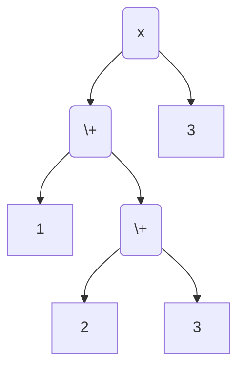
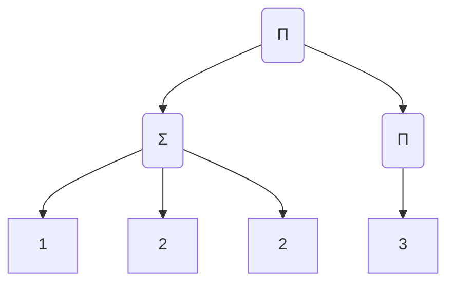

# Notation
$[n]$ denotes $\{1,2,\cdots,n\}$.

$[m:n]$ denotes $\{m,m+1,\cdots,n\}$ if $n\geq n$. It's an empty set otherwise.

$a_{m:n}$ denotes $a_m,a_{m+1},\cdots,a_n$.

$\{\{1,1,2^{(3)}\}\}$ denotes the multiset with two 1s and three 2s in it.

# The Problem
Given several positive integers $a_{1:n}$, what's the maximum value that can be
achieved by four basic operations, additions, subtractions, multiplications and
divisions? Every number is used exactly once. (Provider: 雷伊布是真的狗 aka
雷狗)

For example, given 1,1,2,3, a possible result is $4/3=(1+1)\times 2/3$ but the
largest result is $12=(1+1)\times 2\times3$.

# Some Intermediate results

An expression can be parsed into an Abstract Syntax Tree(AST). Every leaf in the
tree is a number and every non-leaf node is an operation among `+-x/`. The root
represents the final result. When a node is involved in an arithmetics
calculation, its value is the evaluation of its subtree. The depth of a node is
defined as the length of the shortest path to the root. Specifically, the depth
of the root is 0. $L(K)$ stands for the left child of node $K$ and $R(K)$ stands
for the right.

## Only Additions and Multiplications

Firstly, We only consider additions and multiplications.

To simplify the structure of the tree, let's introduce a new node $\sum$ whose
result is the addition of all of its children. Similarly, $\prod$ is used to
represents the multiplication of all of its children. If $\sum$ or $\prod$ has
only one child, the value of them is simply the value of their child.
For example, the following two trees are equivalent.




An AST is called *shallow* if 
1. its root is $\prod$
2. all nodes of depth 1 is $\sum$
3. all the leaf are of depth 3 and are all numbers.
4. the multiset composed of the children of a $\sum$ node is among the following
   3 forms: $\{\{a\}\},\{\{1, a\}\},\{\{1,1,1\}\}$ where $a$ is a positive
   integer.

Define $M(S)$ as the maximum number we could achieve by four basic operations
with a multiset $S$ of positive intergers provided. Also, define $M_+(S)$ as the
maximum number we could achieve by sums and products with a multiset $S$ of
positive intergers provided.

We omit the tedious $\{\{\}\}$ symbol in $M(S)$ for brevity if there is no
ambiguity. For instance, $M(2,3,3)=M(\{\{2,3,3\}\})$. Additionally, given a node
$K$ in the AST, we use $M(K)$ to represents The maximal achievable value given
leaves of the subtree of $K$.

**Proposition** Given a positive integer multiset $S$, $M_+(S)$ can be achieved
by a shallow AST.

**Proof** Suppose $T$ is an AST that acquires the maximum possible value by
multiplications and productions.
We could substitude $\sum$ for $+$ and $\prod$ for $\times$ easily. 
Suppose the root is $\prod$, otherwise we might add a new $\prod$ node as the
root of the tree. Also, the parent node and
its child cannot be of the same type, namely, $\sum$ and $\prod$, otherwise they are to
be combined together. So, all the nodes of depth 1 are $\sum$ now. $T$ has
satisfied the condition 1 and 2 of a shallow AST by now. We can make any
non-leaf node deeper than 1 has at least two children as well for the
convenience of the future discussion.

Let $\sum_{1:m}$ denotes all the $\sum$ nodes of depth 1. If there is a node $U$
of depth 2 that is not a leaf, let its parent be $\sum_1$ without loss of
generality. Let $U_{1:l}$ be the children of $\sum_1$ and $U_1=U$. $U$ must be a
$\prod$ node with children $C_{1:t}$ where $t\geq 2$. If one of $C_{1:t}$ is 1,
they take no effect here and could have been used to plus 1 outmost, which
contradicts with the maximality of the result of $T$. Therefore, $C_{1:t} \geq
2$.

Try to remove $C_1$ and attach all its children directly to the root. Then we
have the new result is no less than the former result.

$$
\left(\prod_{i\in[1:t]} C_i + \sum_{i\in[2:l]} U_i \right) \prod_{i\in [2:m]} \Sigma_{i}
\leq 
C_1\left(\prod_{i\in[2:t]} C_i + \sum_{i\in[2:l]} U_i \right) \prod_{i\in [2:m]} \Sigma_{i}
$$

The equality must holds because of the maximality. Therefore, $l$ must be $1$.
We might as well move $C_1$'s children upwards to the root without decreasing
the final result and delete node $A_1$. The number of non-leaf nodes of depth 2
decreases in this procedure. Continue with this policy and we will get an AST
whose nodes of depths 2 are all leaves. $T$ has satisfied the first three
conditions of shallowness.

If there is a $\sum$ node of depth 1 whose children can be divided into two
groups such that each sum of them is larger than 1, multiply these two children
instead of adding them results in a larger value since $ab > a + b$ when $a,b
\geq 2$, contradicting maximality. Therefore, any dichotomy of the children of a
$\sum$ node must contain a $1$ as its partition member, which implies the last
condition to be a shallow AST. $\quad\blacksquare$

**Proposition** $M_+(1)=1$ and $M_+(1^{(n)}) = 2^{\lambda(n)}
3^{\frac {n-2\lambda(n)} 3} $ when $n\geq 2$ where 

$$
\lambda(n) = 2-(n-1)\%3 = 
\begin{cases}
0 &\text{if } n\equiv 0 (\text{mod }3) \\
2 &\text{if } n\equiv 1 (\text{mod }3) \\
1 &\text{if } n\equiv 2 (\text{mod }3) 
\end{cases}
$$

**Proof**. $M_+$ can be achieved by a shallow AST. The $\sum$ node can only be
$1+1$ or $1+1+1$. Suppose there are t $(1+1)$s. Then, the final result is $2^t
3^{(\frac{n-2t}{3})}$ which is a monotonically decreasing function with respect
to $t$. So we need as few double 1s as possible. It is easy to see that
there are at least $\lambda(n)$ $(1+1)$s. $\quad\blacksquare$

> Actually, M_+(1^(n)) is [this series](https://oeis.org/A000792).

According to the propositions we have derived, the maximum can be achieved by
choosing $t$ 1s and add them to $t$ smallest numbers larger than 1 and the rest
1s are grouped to achieve their maximum. Multiplying these two parts obstains
$M_+(S)$. Example: $M_+(2^{(3)},3,1^{(5)})=(2+1)\times(2+1)\times2\times3\times(1+1+1)$.

Pseudo-code is demonstrated below.

```python
def M_plus_ones(n):
    return the maximum value that can be achieved with n ones

def M_plus(S: Array[Int]):
    t = num_ones(S) # Number of ones in the array
    S = remove_ones(S) # Remove all ones from the array
    S = sort(S) # sort them in ascending order
    prod = product(S)
    maximum = prod * M_plus_ones(t)
    while S not emply and t >= 1:
        m = smallest(S)
        maximum = max(maximum, prod / m * (m+1) * M_plus_ones(t-1))
        t -= 1
        S.remove(m)
    return maximum
```

Further analysis optimizes the algorithm from O(nlog) to O(n) without sorting
numbers. Hint: $(1+a) (1+b) < (1+1)ab$ if $a,b\geq 2$

## Only Numbers larger than 1

Secondly, let's consider the cases where all the numbers large than 1 with four
basic operations. We have shown that the maximum achievable value with additions
and multiplications is simply the multiplication of all the numbers. We would
prove that this value is precisely $M(S)$.


Then, we assert a stronger statement. Define $M^* (S)$ as the maximum value
that we can get by four basic operations and inserting negative sign into
arbitary positions. Clearly, $M^* (S) \geq M(S) \geq M_+(S)$. The following
proposition implies the equality is achieved, thus giving $M(S)=M_+(S)$.

Before proving that, we are going to introduce a concept to measure how many
operations is done to get this node. We call a node *$n$-lush* if the subtree of
it has $n$ leaves. Specifically, a leaf is 1-lush.

**Proposition.** $M^* (S)=M_+(S)$ if all the elements in $S$ is larger than 1.

**Proof.** It is trivial when $S$ has only one element. Assume $\#S\geq2$. We
are going to prove by contradiction. Suppose $S$ is the multiset that has the
minimum number of elements which makes $M^* (S) > M_+(S)$. Let $T$ be the
maximum AST of $S$, the root being $O$. There must not be zero for any
intermediate calculation result for the maximality of $T$.

We have $M_+(L(O)),M_+(R(O)) \geq 2$ where $M_+(K)$ represents the the
multiplication of all leaves on the subtree of node $K$.

*Case 1*. If the root node is $+$ or $-$, 

$$ 
\begin{align*}
|L(O)\pm R(O)| &\leq |L(O)|+|R(O)| \\
&\leq M_+(L(O)) + M_+(R(O)) \\
&\lt M_+(L(O))M_+(R(O)) = M_+(S)
\end{align*}
$$
which contradicts the maximality of $T$

*Case 2*. If the root node is $\times$, 

$$ 
|L(O)\times R(O)| \leq M_+(L(O))M_+(R(O)) = M_+(S)
$$
which contradicts $M^* (S) > M_+(S)$.

*Case 3*. If the root node is $\div$, $|L(O) \div R(O)| > |L(O)| M_+ (R(O))$.
So, $|R(O)| M_+(R(O)) < 1$

If $R(O)$ is a leaf, that's impossible. Therefore, $R(O)$ is an $n$-lush node
where $n \geq 2$

But as you will see shortly, that's impossible. Let's first introduce some
concepts. Replace a non-$\div$ node whose children are leaves with a single node
of the same integer value in place iteratively. The *reduced* AST, $\bar{T}$, is
obtained after the prunning program. We would use $\bar{K}$ to represent the
counterpart in $\bar{T}$ of a node $K$ in $T$. If $\bar{K}$ is $n$-lush, then
$K$ is called reduce $n$-lush. A rational number $p/q$ is called the canonical
representation if $\text{gcd}(p, q)=1, q > 0$. (Never mind with 0s canonical
representation because we'll never see 0 in $T$)

We would prove the following statement to get a contradiction.

> An reduced $n$-lush node $N$ in $T$, whose canonical representation is $p/q$,
> must satisfy $|p| + q < M_+(N) $ and $q \leq M_+(N)/2$ where $n\leq 2$.

There must be a $\div$ node in the subtree of $R(O)$. Otherwise, $R(O)$ must be
an integer which is impossible because $|R(O)| M_+(R(O)) < 1$. Therefore, $R(O)$
must be a reduced $n$-lush node where $n\geq 2$. With the above statement
applied, $|R(O)| \leq 1/(M_+(R(O))-2) < 1/M_+(R(O))$ resulting in a
contradiction, the proposition proved.

So let's prove the statement now by induction. Firstly, consider if the node $N$
is reduced 2-lush. It must be a $\div$ node according to the prunning policy. If
either of its children's absolute value is 1, this child must be a non-leaf
node. Without loss of generality, let $|L(N)|=1$. Then we have 

$$1 + |R(N)| < M_+(L(N))M_+(R(N)) = M_+(N)$$ 

because $M_+(L(N)),M_+(R(N))\geq 2$.

If $|L(N)|,|R(N)|\geq 2$, $|L(N)|+|R(N)| <
|L(N)||R(N)| \leq M_+(N)$ because there is no $\div$ node in $L(N)$ or $R(N)$.

No matter which case, we always have 

$$q \leq \max\{M_+(L(N)), M_+(R(N)) \} \leq M_+(N)/2.$$

If the statement for $n=k$ is proved, the following is devoted to prove the
statement for $n=k+1$.

Case i. $N$ is addition or subtraction.
If either $L(N)$ or $R(N)$ is a leaf in $\bar{T}$, suppose it is $L(N)$ without
loss of generality. Let $L(N) = a \in \mathbb{Z}\backslash\{0\}$ and the canonical
representation of $R(N)$ be $p/q$. Then $N = a + p/q$ and 

$$
\begin{align}
|aq| + |p| + |q| &< |aq| + M_+(R(N)) \\
&\leq |a|M_+(R(N))/2 + M_+(R(N)) \\
&\leq M_+(L(N))M_+(R(N))\\
&= M_+(N)
\end{align}
$$

$$
q \leq M_+(R(N))/2 \leq  M_+(N)/2
$$

Otherwise, both $L(N)$ and $R(N)$ are non-leaf nodes in $\bar T$. Then we might
use the induction hypothesis on both side. Let $p_1/q_1,
p_2/q_2$ be the canonical representation of $L(N), R(N)$ respectively. We have

$$
\begin{align}
& p_1 q_2 + p_2 q_1 + q_1 q_2 \\
\leq& (M_+(L(N)) - q_1)q_2 + (M_+(R(N)) - q_2)q_1 + q_1 q_2 \\
\leq& M_+(L(N))q_2 + M_+(R(N))q_1 - q_1q_2 \\
\leq& M_+(L(N))M_+(R(N))/2 + M_+(R(N))M_+(L(N))/2 - q_1q_2 \\
<& M_+(L(N))M_+(R(N)) = M_+(N)
\end{align}
$$

$$
q_1q_2 \leq M_+(L(N))/2 \cdot M_+(R(N))/2 \leq M_+(N)/2
$$

Case ii. $N$ is multiplication.

Follow the notation in case i.
If either $L(N)$ or $R(N)$ is a leaf in $\bar{T}$, we have

$$
\begin{align}
|ap| + |q| & \leq |a|(M_+(L(N))-|q|) + |q| \\ 
& \leq |a|M_+(L(N)) \\
& \leq M_+(N)
\end{align}
$$

Note that the equality holds when $|a|=1$ and $|a|=M_+(L(N))$ which is
impossible.

Further more,

$$
|q| \leq M_+(R(N))/2 < M_+(N)/2
$$

Otherwise, both $L(N)$ and $R(N)$ are non-leaf nodes in $\bar T$.

$$
\begin{align}
p_1 p_2 + q_1 q_2 &\leq (M_+(L(N))-q_1)(M_+(R(N))-q_2) + q_1 q_2 \\
&\leq M_+(N) - M_+(R(N))q_1 - M_+(L(N))q_2 + q_1q_2 \\
&< M_+(N) 
\end{align}
$$

$$
q_1 q_2 \leq  M_+(L(N))/2 \cdot M_+(R(N))/2 < M_+(N) /2
$$


Case iii. $N$ is division.

Follow the notation in case i.
If either $L(N)$ or $R(N)$ is a leaf in $\bar{T}$, let's suppose $L(N)=a$ first.
We have

$$
\begin{align}
|aq| + |p| & \leq |a|q + M_+(R(N)) - q \\ 
& < |a|M_+(R(N))/2 + M_+(R(N)) \\
& \leq M_+(L(N))M_+(R(N)) = M_+(N)
\end{align}
$$

Further more,

$$
|p| < M_+(R(N)) \leq M_+(N)/2
$$

Then let's consider $R(N)=a$. We have

$$
\begin{align}
|aq| + |p| & \leq |a|q + M_+(L(N)) - q \\ 
& < |a|M_+(L(N))/2 + M_+(L(N)) \\
& \leq M_+(R(N))M_+(L(N)) = M_+(N)
\end{align}
$$

Moreover,

$$
a|q| \leq M_+(L(N))/2 \leq M_+(N)/2
$$

Otherwise, both $L(N)$ and $R(N)$ are non-leaf nodes in $\bar T$.

$$
\begin{align}
& p_1 q_2 + p_2 q_1 \\
<& M_+(L(N))q_2 + M_+(R(N))q_1 \\
\leq& M_+(L(N))M_+(R(N))/2 + M_+(R(N))M_+(L(N))/2\\
=& M_+(N)
\end{align}
$$

$$
q_2 p_1 \leq  M_+(R(N))/2 \cdot M_+(L(N)) = M_+(N) /2
$$

$\blacksquare$

# TODO
As for the original problem, I think we can prove $M(S)=M_+(S)$ as well
following a similar path in the case where all integers are larger than 1, but
the inequality needs more precise analysis and discussion. We leave it for
future work.
