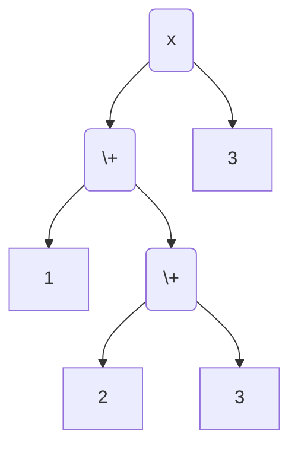
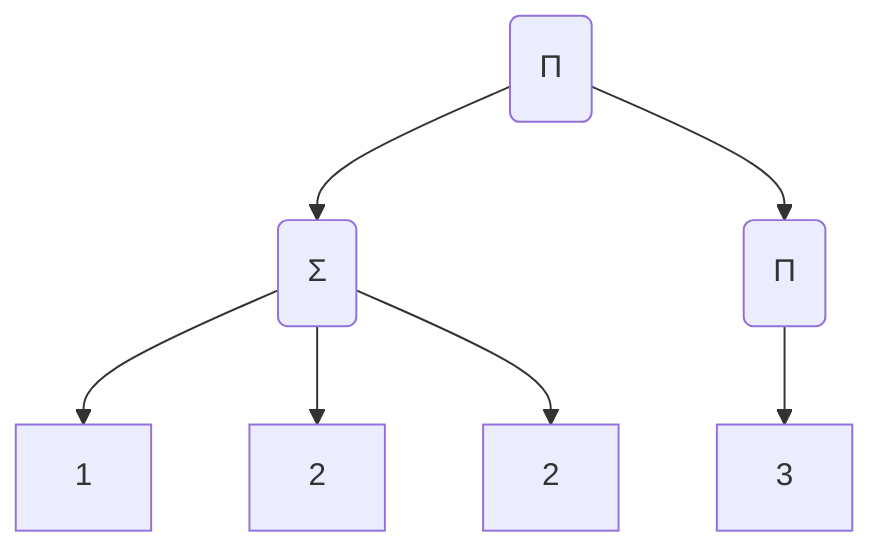

# Notation
$[n]$ denotes $\{1,2,\cdots,n\}$.

$[m:n]$ denotes $\{m,m+1,\cdots,n\}$ if $m\geq n$. It's an empty set otherwise.

$a_{m:n}$ denotes $a_m,a_{m+1},\cdots,a_n$.

$\{\{1,1,2^{(3)}\}\}$ denotes the multiset with two 1s and three 2s in it.

# The Problem
Given several positive integers $a_{1:n}$, what's the maximum value that can be
achieved by four basic operations, additions, subtractions, multiplications and
divisions? Every number is used exactly once. (Provider: 雷伊布是真的狗 aka
雷狗)

For example, given 1,1,2,3, a possible result is $4/3=(1+1)\times 2/3$ but the
largest result is $12=(1+1)\times 2\times3$.

# Some Intermediate results

An expression can be parsed into an Abstract Syntax Tree(AST). Every leaf in the
tree is a number and every non-leaf node is an operation among `+-x/`. The root
represents the final result. When a node is involved in an arithmetic
calculation, its value is the evaluation of its subtree. The depth of a node is
defined as the length of the shortest path to the root. Specifically, the depth
of the root is 0. $L(K)$ stands for the left child of node $K$ and $R(K)$ stands
for the right.

## Only Additions and Multiplications

Firstly, We only consider additions and multiplications.

To simplify the structure of the tree, let's introduce a new node $\sum$ whose
result is the addition of all of its children. Similarly, $\prod$ is used to
represents the multiplication of all of its children. If $\sum$ or $\prod$ has
only one child, the value of them is simply the value of their child.
For example, the following two trees are equivalent.




An AST is called *shallow* if 
1. its root is $\prod$
2. all nodes of depth 1 is $\sum$
3. all the leaves are of depth 2 and are all numbers.
4. the multiset composed of the children of a $\sum$ node is among the following
   3 forms: $\{\{a\}\},\{\{1, a\}\},\{\{1,1,1\}\}$ where $a$ is a positive
   integer.

Define $M(S)$ as the maximum number we could achieve by four basic operations
with a multiset $S$ of positive integers provided. Also, define $M_+(S)$ as the
maximum number we could achieve by sums and products with a multiset $S$ of
positive integers provided.

We omit the tedious $\{\{\}\}$ symbol in $M(S)$ for brevity if there is no
ambiguity. For instance, $M(2,3,3)=M(\{\{2,3,3\}\})$. Additionally, given a node
$K$ in the AST, we use $M(K)$ to represents The maximal achievable value given
leaves of the subtree of $K$.

**Proposition** Given a positive integer multiset $S$, $M_+(S)$ can be achieved
by a shallow AST.

**Proof** Suppose $T$ is an AST that acquires the maximum possible value by
multiplications and products.
We could substitute $\sum$ for $+$ and $\prod$ for $\times$ easily. 
Suppose the root is $\prod$, otherwise we might add a new $\prod$ node as the
root of the tree. Also, the parent node and
its child cannot be of the same type, namely, $\sum$ and $\prod$, otherwise they are to
be combined together. So, all the nodes of depth 1 are $\sum$ now. $T$ has
satisfied the condition 1 and 2 of a shallow AST by now. We can make any
non-leaf node deeper than 1 has at least two children as well for the
convenience of the future discussion.

Let $\sum_{1:m}$ denotes all the $\sum$ nodes of depth 1. If there is a node $U$
of depth 2 that is not a leaf, let its parent be $\sum_1$ without loss of
generality. Let $U_{1:l}$ be the children of $\sum_1$ and $U_1=U$. $U$ must be a
$\prod$ node with children $C_{1:t}$ where $t\geq 2$. If one of $C_{1:t}$ is 1,
they take no effect here and could have been used to plus 1 outmost, which
contradicts with the maximality of the result of $T$. Therefore, $C_{1:t} \geq
2$.

Try to remove $C_1$ and attach all its children directly to the root. Then we
have the new result is no less than the former result.

$$
\left(\prod_{i\in[1:t]} C_i + \sum_{i\in[2:l]} U_i \right) \prod_{i\in [2:m]} \Sigma_{i}
\leq 
C_1\left(\prod_{i\in[2:t]} C_i + \sum_{i\in[2:l]} U_i \right) \prod_{i\in [2:m]} \Sigma_{i}
$$

The equality must holds because of the maximality. Therefore, $l$ must be $1$.
We might as well move $C_1$'s children upwards to the root without decreasing
the final result and delete node $A_1$. The number of non-leaf nodes of depth 2
decreases in this procedure. Continue with this policy and we will get an AST
whose nodes of depths 2 are all leaves. $T$ has satisfied the first three
conditions of shallowness.

If there is a $\sum$ node of depth 1 whose children can be divided into two
groups such that each sum of them is larger than 1, multiply these two children
instead of adding them results in a larger value since $ab > a + b$ when $a,b
\geq 2$, contradicting maximality. Therefore, any dichotomy of the children of a
$\sum$ node must contain a $1$ as its partition member, which implies the last
condition to be a shallow AST. $\quad\blacksquare$

**Proposition** $M_+(1)=1$ and $M_+(1^{(n)}) = 2^{\lambda(n)}
3^{\frac {n-2\lambda(n)} 3} $ when $n\geq 2$ where 

$$
\lambda(n) = 2-(n-1)\%3 = 
\begin{cases}
0 &\text{if } n\equiv 0 (\text{mod }3) \\
2 &\text{if } n\equiv 1 (\text{mod }3) \\
1 &\text{if } n\equiv 2 (\text{mod }3) 
\end{cases}
$$

**Proof**. $M_+$ can be achieved by a shallow AST. The $\sum$ node can only be
$1+1$ or $1+1+1$. Suppose there are t $(1+1)$s. Then, the final result is $2^t
3^{(\frac{n-2t}{3})}$ which is a monotonically decreasing function with respect
to $t$. So we need as few double 1s as possible. It is easy to see that
there are at least $\lambda(n)$ $(1+1)$s. $\quad\blacksquare$

> Actually, M_+(1^(n)) is [this series](https://oeis.org/A000792).

According to the propositions we have derived, the maximum can be achieved by
choosing $t$ 1s and add them to $t$ smallest numbers larger than 1 and the rest
1s are grouped to achieve their maximum. Multiplying these two parts obtains
$M_+(S)$. Example: $M_+(2^{(3)},3,1^{(5)})=(2+1)\times(2+1)\times2\times3\times(1+1+1)$.

Pseudo-code is demonstrated below.

```python
def M_plus_ones(n):
    return the maximum value that can be achieved with n ones

def M_plus(S: Array[Int]):
    t = num_ones(S) # Number of ones in the array
    S = remove_ones(S) # Remove all ones from the array
    S = sort(S) # sort them in ascending order
    prod = product(S)
    maximum = prod * M_plus_ones(t)
    while S not empty and t >= 1:
        m = smallest(S)
        maximum = max(maximum, prod / m * (m+1) * M_plus_ones(t-1))
        t -= 1
        S.remove(m)
    return maximum
```

Further analysis optimizes the algorithm from O(nlog) to O(n) without sorting
numbers. Hint: $(1+a) (1+b) < (1+1)ab$ if $a,b\geq 2$

## Only Numbers larger than 1

Secondly, let's consider the cases where all numbers large than 1 with four
basic operations. We have shown that the maximum achievable value with additions
and multiplications is simply the multiplication of all numbers. We would
prove that this value is precisely $M(S)$.


Then, we assert a stronger statement. Define $M^* (S)$ as the maximum value
that we can get by four basic operations and inserting negative sign into
arbitrary positions. Clearly, $M^* (S) \geq M(S) \geq M_+(S)$. The following
proposition implies the equality is achieved, thus giving $M(S)=M_+(S)$.

Before proving that, we are going to introduce a concept to measure how many
operations is done to get this node. We call a node *$n$-lush* if the subtree of
it has $n$ leaves. Specifically, a leaf is 1-lush.

**Proposition.** $M^* (S)=M_+(S)$ if all the elements in $S$ is larger than 1.

**Proof.** It is trivial when $S$ has only one element. Assume $\#S\geq2$. We
are going to prove by contradiction. Suppose $S$ is the multiset that has the
minimum number of elements which makes $M^* (S) > M_+(S)$. Let $T$ be the
maximum AST of $S$, the root being $O$. There must not be zero for any
intermediate calculation result for the maximality of $T$.

We have $M_+(L(O)),M_+(R(O)) \geq 2$ where $M_+(K)$ represents the the
multiplication of all leaves on the subtree of node $K$.

*Case 1*. If the root node is $+$ or $-$, 

$$ 
\begin{align*}
|L(O)\pm R(O)| &\leq |L(O)|+|R(O)| \\
&\leq M_+(L(O)) + M_+(R(O)) \\
&\lt M_+(L(O))M_+(R(O)) = M_+(S)
\end{align*}
$$
which contradicts the maximality of $T$

*Case 2*. If the root node is $\times$, 

$$ 
|L(O)\times R(O)| \leq M_+(L(O))M_+(R(O)) = M_+(S)
$$
which contradicts $M^* (S) > M_+(S)$.

*Case 3*. If the root node is $\div$, $|L(O) \div R(O)| > |L(O)| M_+ (R(O))$.
So, $|R(O)| M_+(R(O)) < 1$

If $R(O)$ is a leaf, that's impossible. Therefore, $R(O)$ is an $n$-lush node
where $n \geq 2$

But as you will see shortly, that's impossible. Let's first introduce some
concepts. Replace a non-$\div$ node whose children are leaves with a single node
of the same integer value in place iteratively. The *reduced* AST, $\bar{T}$, is
obtained after the pruning program. We would use $\bar{K}$ to represent the
counterpart in $\bar{T}$ of a node $K$ in $T$. If $\bar{K}$ is $n$-lush, then
$K$ is called reduce $n$-lush. A rational number $p/q$ is called the canonical
representation if $\text{gcd}(p, q)=1, q > 0$. (Never mind with 0s canonical
representation because we'll never see 0 in $T$)

We would prove the following statement to get a contradiction.

> An reduced $n$-lush node $N$ in $T$, whose canonical representation is $p/q$,
> must satisfy $|p| + q < M_+(N) $ and $q \leq M_+(N)/2$ where $n\leq 2$.

There must be a $\div$ node in the subtree of $R(O)$. Otherwise, $R(O)$ must be
an integer which is impossible because $|R(O)| M_+(R(O)) < 1$. Therefore, $R(O)$
must be a reduced $n$-lush node where $n\geq 2$. With the above statement
applied, $|R(O)| \leq 1/(M_+(R(O))-2) < 1/M_+(R(O))$ resulting in a
contradiction, the proposition proved.

So let's prove the statement now by induction. Firstly, consider if the node $N$
is reduced 2-lush. It must be a $\div$ node according to the pruning policy. If
either of its children's absolute value is 1, this child must be a non-leaf
node. Without loss of generality, let $|L(N)|=1$. Then we have 

$$1 + |R(N)| < M_+(L(N))M_+(R(N)) = M_+(N)$$ 

because $M_+(L(N)),M_+(R(N))\geq 2$.

If $|L(N)|,|R(N)|\geq 2$, $|L(N)|+|R(N)| <
|L(N)||R(N)| \leq M_+(N)$ because there is no $\div$ node in $L(N)$ or $R(N)$.

No matter which case, we always have 

$$q \leq \max\{M_+(L(N)), M_+(R(N)) \} \leq M_+(N)/2.$$

If the statement for $n=k$ is proved, the following is devoted to prove the
statement for $n=k+1$.

Case i. $N$ is addition or subtraction.
If either $L(N)$ or $R(N)$ is a leaf in $\bar{T}$, suppose it is $L(N)$ without
loss of generality. Let $L(N) = a \in \mathbb{Z}\backslash\{0\}$ and the canonical
representation of $R(N)$ be $p/q$. Then $N = a + p/q$ and 

$$
\begin{align}
|aq| + |p| + |q| &< |aq| + M_+(R(N)) \\
&\leq |a|M_+(R(N))/2 + M_+(R(N)) \\
&\leq M_+(L(N))M_+(R(N))\\
&= M_+(N)
\end{align}
$$

$$
q \leq M_+(R(N))/2 \leq  M_+(N)/2
$$

Otherwise, both $L(N)$ and $R(N)$ are non-leaf nodes in $\bar T$. Then we might
use the induction hypothesis on both side. Let $p_1/q_1,
p_2/q_2$ be the canonical representation of $L(N), R(N)$ respectively. We have

$$
\begin{align}
& p_1 q_2 + p_2 q_1 + q_1 q_2 \\
\leq& (M_+(L(N)) - q_1)q_2 + (M_+(R(N)) - q_2)q_1 + q_1 q_2 \\
\leq& M_+(L(N))q_2 + M_+(R(N))q_1 - q_1q_2 \\
\leq& M_+(L(N))M_+(R(N))/2 + M_+(R(N))M_+(L(N))/2 - q_1q_2 \\
<& M_+(L(N))M_+(R(N)) = M_+(N)
\end{align}
$$

$$
q_1q_2 \leq M_+(L(N))/2 \cdot M_+(R(N))/2 \leq M_+(N)/2
$$

Case ii. $N$ is multiplication.

Follow the notation in case i.
If either $L(N)$ or $R(N)$ is a leaf in $\bar{T}$, we have

$$
\begin{align}
|ap| + |q| & \leq |a|(M_+(L(N))-|q|) + |q| \\ 
& \leq |a|M_+(L(N)) \\
& \leq M_+(N)
\end{align}
$$

Note that the equality holds when $|a|=1$ and $|a|=M_+(L(N))$ which is
impossible.

Further more,

$$
|q| \leq M_+(R(N))/2 < M_+(N)/2
$$

Otherwise, both $L(N)$ and $R(N)$ are non-leaf nodes in $\bar T$.

$$
\begin{align}
p_1 p_2 + q_1 q_2 &\leq (M_+(L(N))-q_1)(M_+(R(N))-q_2) + q_1 q_2 \\
&\leq M_+(N) - M_+(R(N))q_1 - M_+(L(N))q_2 + q_1q_2 \\
&< M_+(N) 
\end{align}
$$

$$
q_1 q_2 \leq  M_+(L(N))/2 \cdot M_+(R(N))/2 < M_+(N) /2
$$


Case iii. $N$ is division.

Follow the notation in case i.
If either $L(N)$ or $R(N)$ is a leaf in $\bar{T}$, let's suppose $L(N)=a$ first.
We have

$$
\begin{align}
|aq| + |p| & \leq |a|q + M_+(R(N)) - q \\ 
& < |a|M_+(R(N))/2 + M_+(R(N)) \\
& \leq M_+(L(N))M_+(R(N)) = M_+(N)
\end{align}
$$

Further more,

$$
|p| < M_+(R(N)) \leq M_+(N)/2
$$

Then let's consider $R(N)=a$. We have

$$
\begin{align}
|aq| + |p| & \leq |a|q + M_+(L(N)) - q \\ 
& < |a|M_+(L(N))/2 + M_+(L(N)) \\
& \leq M_+(R(N))M_+(L(N)) = M_+(N)
\end{align}
$$

Moreover,

$$
a|q| \leq M_+(L(N))/2 \leq M_+(N)/2
$$

Otherwise, both $L(N)$ and $R(N)$ are non-leaf nodes in $\bar T$.

$$
\begin{align}
& p_1 q_2 + p_2 q_1 \\
<& M_+(L(N))q_2 + M_+(R(N))q_1 \\
\leq& M_+(L(N))M_+(R(N))/2 + M_+(R(N))M_+(L(N))/2\\
=& M_+(N)
\end{align}
$$

$$
q_2 p_1 \leq  M_+(R(N))/2 \cdot M_+(L(N)) = M_+(N) /2
$$

$\blacksquare$

## All numbers are 1 (WIP)

Define pseudo fractions as fractions but never simplifies itself. For example, the normal addiction of fractions is like $a/b + c/d = (ad+bc)/(bd)$ and then both the numerator and the denominator are divided by their greatest common divisor. But a pseudo fraction never divides. $2/6 + 6/12 = 60/72$ in the sense of pseudo fractions. Similarly, $(6/4)*(2/6) = 12/24$. Given an expression containing $n$ 1's, whose result is $a/b$ evaluated under normal computing rules, changing all minus signs in the expression to plus signs and evaluating it in the sense of pseudo fractions. It produces a result in the form of a pseudo fraction $c/d$. It is easy to prove that $c\ge a$ and $d\ge b$.

We will prove that $c+d\le M_+(1^{(n)}) + 1$, thus $a/b \leq (|a|+|b|-1)/1 \leq c+d-1 \leq M_+(1^{(n)})$, which is exactly our goal.

For pseudo fractions, define $a/b \geq\!\!\!\geq c/d$ if $a\ge c$ and $b\ge d$. If we can construct two pseudo fractions $a/b$ and $c/d$ with the same number of 1's and $a/b \geq\!\!\!\geq c/d$, then we can discard $c/d$ since $a/b$ will be always better when we use $a/b$ to construct more complicated pseudo fractions. Consider a set of all the pseudo fractions that could possibly be constructed by $n$ 1's. $\geq\!\!\!\geq$ induced a partial order in the set. Let's call the maximal elements in the partially ordered set **pivot** pseudo fractions. Let's call the minimal number of 1's required to construct a pseudo fraction the **order** of the pseudo fraction. It is apparent that every pivot pseudo fraction of order larger than 1 can be constructed by two pivot pseudo fractions of lower orders.

Let's construct a table containing all the "pivot" pseudo fractions like this:

Pseudo code
```text
The first row is 1/1
for i in {2,3,4,...}
    create an empty list new_row
    for j in {1,2,...,i-1}
        for a pseudo fraction f1 in j-th row
            for a pseudo fraction f2 in (i-j)-th row
                for op in {+,*,/}
                    calculate the pseudo fraction f3 = f1 op f2
                    flag = 0
                    for f4 in new_row
                        if f3 >>= f4
                            flag = 1
                            remove f3 from new_row
                    if flag == 1
                        add f4 to new_row
    let new_row be the i-th row of the table
```

A complete python script
```python
from functools import total_ordering


@total_ordering
class Frac:
    def __init__(self, numerator, denominator=1):
        if denominator == 0:
            raise ValueError("Denominator cannot be zero.")

        self.numerator = numerator
        self.denominator = denominator
        self.source = ""

    def __str__(self):
        """Returns a string representation like '3/4'."""
        return f"{self.numerator}/{self.denominator}"

    def __repr__(self):
        """Official string representation for debugging."""
        return f"Frac({self.numerator}, {self.denominator})"

    def __eq__(self, other):
        """Checks equality: a/b == c/d"""
        if isinstance(other, int):
            other = Frac(other)
        # Since we simplify in __init__, we can just compare num and denom directly
        return (
            self.numerator == other.numerator and self.denominator == other.denominator
        )

    def __lt__(self, other):
        """Checks less than (<): a/b < c/d <=> ad < bc"""
        if isinstance(other, int):
            other = Frac(other)
        # Cross-multiply to compare without losing precision to floating points
        return self.numerator < other.numerator

    # --- Arithmetic Operations ---

    def __add__(self, other):
        """Implements addition (+). formula: a/b + c/d = (ad + bc) / bd"""
        if isinstance(other, int):
            other = Frac(other)

        new_num = (self.numerator * other.denominator) + (
            other.numerator * self.denominator
        )
        new_denom = self.denominator * other.denominator
        return Frac(new_num, new_denom)

    def __mul__(self, other):
        """Implements multiplication (*). formula: a/b * c/d = (ac) / (bd)"""
        if isinstance(other, int):
            other = Frac(other)

        new_num = self.numerator * other.numerator
        new_denom = self.denominator * other.denominator
        return Frac(new_num, new_denom)

    def __truediv__(self, other):
        """Implements division (/). formula: (a/b) / (c/d) = (ad) / (bc)"""
        if isinstance(other, int):
            other = Frac(other)

        if other.numerator == 0:
            raise ZeroDivisionError("Cannot divide by a fraction with zero numerator.")

        new_num = self.numerator * other.denominator
        new_denom = self.denominator * other.numerator
        return Frac(new_num, new_denom)

def maj_update(fracs, c):
    if any(d.numerator >= c.numerator and d.denominator >= c.denominator for d in fracs):
        return
    
    fracs[:] = [d for d in fracs 
                if not (d.numerator <= c.numerator and d.denominator <= c.denominator)]
    fracs.append(c)


def pretty_print(arr):
    for i in range(1, len(arr)):
        o = ""
        for f in arr[i]:
            if len(f.source) == 0:
                o += str(f) + " "
            else:
                o += str(f) + "=" + f.source + " "
        print(o)


def ternary_print(arr):
    for i in range(1, len(arr)):
        # if i % 3 != 2:
        #     continue
        o = ""
        for f in arr[i]:
            o += (
                decimal_to_ternary(f.numerator)
                + "/"
                + decimal_to_ternary(f.denominator)
                + " "
            )
        print(o)


def decimal_to_ternary(n):
    if n == 0:
        return "0"

    result = ""
    negative = n < 0
    n = abs(n)

    while n > 0:
        result = str(n % 3) + result
        n //= 3

    return "-" + result if negative else result

if __name__ == "__main__":
    arr = [
        [
            Frac(0),
        ],
        [
            Frac(1),
        ],
    ]
    # n = int(input())
    n = 20
    for i in range(2, n + 1):
        new_frac = []
        if i > 3:
            for a in arr[i-3]:
                c = Frac(3)*a
                c.source = "3/1*" + str(a)
                maj_update(new_frac, c)
        for j in range(1, i//2 + 1):
            for a in arr[j]:
                for b in arr[i - j]:
                    c = a+b
                    c.source = str(a) + "+" + str(b)
                    maj_update(new_frac, c)
                    c = a*b
                    c.source = str(a) + "*" + str(b)
                    maj_update(new_frac, c)
                    c = a/b
                    c.source = str(a) + "/" + str(b)
                    maj_update(new_frac, c)
                    c = b/a
                    c.source = str(b) + "/" + str(a)
                    maj_update(new_frac, c)
        new_frac.sort(reverse=True)
        arr.append(new_frac)
    pretty_print(arr)
```

The first 20 rows
```text
1/1 
2/1 
3/1 1/2 
4/1 3/2 1/3 
6/1 5/2 4/3 1/4 
9/1 7/3 5/4 2/5 1/6 
12/1 10/3 9/4 7/6 3/7 1/9 
18/1 15/2 14/3 13/6 10/9 3/10 1/12 
27/1 21/3 19/9 13/12 6/13 3/14 2/15 1/18 
36/1 30/3 28/9 25/12 19/18 9/19 3/21 1/27 
54/1 45/2 42/3 39/6 38/9 37/18 28/27 9/28 3/30 1/36 
81/1 63/3 57/9 55/27 37/36 18/37 9/38 6/39 3/42 2/45 1/54 
108/1 90/3 84/9 82/27 73/36 55/54 27/55 9/57 3/63 1/81 
162/1 135/2 126/3 117/6 114/9 111/18 110/27 109/54 82/81 27/82 9/84 3/90 1/108 
243/1 189/3 171/9 165/27 163/81 109/108 54/109 27/110 18/111 9/114 6/117 3/126 2/135 1/162 
324/1 270/3 252/9 246/27 244/81 217/108 163/162 81/163 27/165 9/171 3/189 1/243 
486/1 405/2 378/3 351/6 342/9 333/18 330/27 327/54 326/81 325/162 244/243 81/244 27/246 9/252 3/270 1/324 
729/1 567/3 513/9 495/27 489/81 487/243 325/324 162/325 81/326 54/327 27/330 18/333 9/342 6/351 3/378 2/405 1/486 
972/1 810/3 756/9 738/27 732/81 730/243 649/324 487/486 243/487 81/489 27/495 9/513 3/567 1/729 
1458/1 1215/2 1134/3 1053/6 1026/9 999/18 990/27 981/54 978/81 975/162 974/243 973/486 730/729 243/730 81/732 27/738 9/756 3/810 1/972 
```

Do you find the rule? Turning them to base 3. Then you'll find rows congruent modulo 3 follow the same generation rule.

row $= 3k$:
```text
10/1 1/2 
100/1 21/10 12/11 2/12 1/20 
1000/1 210/10 201/100 111/110 20/111 10/112 2/120 1/200 
10000/1 2100/10 2010/100 2001/1000 1101/1100 200/1101 100/1102 20/1110 10/1120 2/1200 1/2000 
100000/1 21000/10 20100/100 20010/1000 20001/10000 11001/11000 2000/11001 1000/11002 200/11010 100/11020 20/11100 10/11200 2/12000 1/20000 
1000000/1 210000/10 201000/100 200100/1000 200010/10000 200001/100000 110001/110000 20000/110001 10000/110002 2000/110010 1000/110020 200/110100 100/110200 20/111000 10/112000 2/120000 1/200000 
10000000/1 2100000/10 2010000/100 2001000/1000 2000100/10000 2000010/100000 2000001/1000000 1100001/1100000 200000/1100001 100000/1100002 20000/1100010 10000/1100020 2000/1100100 1000/1100200 200/1101000 100/1102000 20/1110000 10/1120000 2/1200000 1/2000000 
100000000/1 21000000/10 20100000/100 20010000/1000 20001000/10000 20000100/100000 20000010/1000000 20000001/10000000 11000001/11000000 2000000/11000001 1000000/11000002 200000/11000010 100000/11000020 20000/11000100 10000/11000200 2000/11001000 1000/11002000 200/11010000 100/11020000 20/11100000 10/11200000 2/12000000 1/20000000 
1000000000/1 210000000/10 201000000/100 200100000/1000 200010000/10000 200001000/100000 200000100/1000000 200000010/10000000 200000001/100000000 110000001/110000000 20000000/110000001 10000000/110000002 2000000/110000010 1000000/110000020 200000/110000100 100000/110000200 20000/110001000 10000/110002000 2000/110010000 1000/110020000 200/110100000 100/110200000 20/111000000 10/112000000 2/120000000 1/200000000 
10000000000/1 2100000000/10 2010000000/100 2001000000/1000 2000100000/10000 2000010000/100000 2000001000/1000000 2000000100/10000000 2000000010/100000000 2000000001/1000000000 1100000001/1100000000 200000000/1100000001 100000000/1100000002 20000000/1100000010 10000000/1100000020 2000000/1100000100 1000000/1100000200 200000/1100001000 100000/1100002000 20000/1100010000 10000/1100020000 2000/1100100000 1000/1100200000 200/1101000000 100/1102000000 20/1110000000 10/1120000000 2/1200000000 1/2000000000 
```

row $= 3k+1$:
```text
1/1 
11/1 10/2 1/10 
110/1 101/10 100/11 21/20 10/21 1/100 
1100/1 1010/10 1001/100 221/110 201/200 100/201 10/210 1/1000 
11000/1 10100/10 10010/100 10001/1000 2201/1100 2001/2000 1000/2001 100/2010 10/2100 1/10000 
110000/1 101000/10 100100/100 100010/1000 100001/10000 22001/11000 20001/20000 10000/20001 1000/20010 100/20100 10/21000 1/100000 
1100000/1 1010000/10 1001000/100 1000100/1000 1000010/10000 1000001/100000 220001/110000 200001/200000 100000/200001 10000/200010 1000/200100 100/201000 10/210000 1/1000000 
11000000/1 10100000/10 10010000/100 10001000/1000 10000100/10000 10000010/100000 10000001/1000000 2200001/1100000 2000001/2000000 1000000/2000001 100000/2000010 10000/2000100 1000/2001000 100/2010000 10/2100000 1/10000000 
110000000/1 101000000/10 100100000/100 100010000/1000 100001000/10000 100000100/100000 100000010/1000000 100000001/10000000 22000001/11000000 20000001/20000000 10000000/20000001 1000000/20000010 100000/20000100 10000/20001000 1000/20010000 100/20100000 10/21000000 1/100000000 
1100000000/1 1010000000/10 1001000000/100 1000100000/1000 1000010000/10000 1000001000/100000 1000000100/1000000 1000000010/10000000 1000000001/100000000 220000001/110000000 200000001/200000000 100000000/200000001 10000000/200000010 1000000/200000100 100000/200001000 10000/200010000 1000/200100000 100/201000000 10/210000000 1/1000000000 
```

row $= 3k+2$:
```text
2/1 
20/1 12/2 11/10 1/11 
200/1 120/2 112/10 111/20 101/100 10/101 1/110 
2000/1 1200/2 1120/10 1110/20 1102/100 1101/200 1001/1000 100/1001 10/1010 1/1100 
20000/1 12000/2 11200/10 11100/20 11020/100 11010/200 11002/1000 11001/2000 10001/10000 1000/10001 100/10010 10/10100 1/11000 
200000/1 120000/2 112000/10 111000/20 110200/100 110100/200 110020/1000 110010/2000 110002/10000 110001/20000 100001/100000 10000/100001 1000/100010 100/100100 10/101000 1/110000 
2000000/1 1200000/2 1120000/10 1110000/20 1102000/100 1101000/200 1100200/1000 1100100/2000 1100020/10000 1100010/20000 1100002/100000 1100001/200000 1000001/1000000 100000/1000001 10000/1000010 1000/1000100 100/1001000 10/1010000 1/1100000 
20000000/1 12000000/2 11200000/10 11100000/20 11020000/100 11010000/200 11002000/1000 11001000/2000 11000200/10000 11000100/20000 11000020/100000 11000010/200000 11000002/1000000 11000001/2000000 10000001/10000000 1000000/10000001 100000/10000010 10000/10000100 1000/10001000 100/10010000 10/10100000 1/11000000 
200000000/1 120000000/2 112000000/10 111000000/20 110200000/100 110100000/200 110020000/1000 110010000/2000 110002000/10000 110001000/20000 110000200/100000 110000100/200000 110000020/1000000 110000010/2000000 110000002/10000000 110000001/20000000 100000001/100000000 10000000/100000001 1000000/100000010 100000/100000100 10000/100001000 1000/100010000 100/100100000 10/101000000 1/110000000 
2000000000/1 1200000000/2 1120000000/10 1110000000/20 1102000000/100 1101000000/200 1100200000/1000 1100100000/2000 1100020000/10000 1100010000/20000 1100002000/100000 1100001000/200000 1100000200/1000000 1100000100/2000000 1100000020/10000000 1100000010/20000000 1100000002/100000000 1100000001/200000000 1000000001/1000000000 100000000/1000000001 10000000/1000000010 1000000/1000000100 100000/1000001000 10000/1000010000 1000/1000100000 100/1001000000 10/1010000000 1/1100000000 
```

A general formula is like the following in mathematica
```mathematica
f[n_, b_] := 
 Module[{mode, a, dpiv, k, s, num, den, j}, mode = Mod[n, 3];
  a = Quotient[n, 3] + If[mode == 0, 0, 1];
  Switch[mode, 0, 
   If[a == 1, Which[b == 1, Return[{3, 1}], b == 2, Return[{1, 2}]]];
   If[b <= a, Return[{2*3^(a - 1) + 3^(a - b), 3^(b - 1)}]];
   dpiv = 3^(a - 1) + 3^(a - 2);
   If[b == a + 1, Return[{dpiv + 1, dpiv}]];
   If[b <= 3*a - 1, k = Quotient[b - (a + 2), 2];
    s = 2 - Mod[b - a, 2];
    Return[{s*3^(a - 2 - k), dpiv + (3 - s)*3^k}]];
   Return[Undefined], 1, 
   If[a == 1, If[b == 1, Return[{1, 1}], Return[Undefined]]];
   If[a == 2, 
    Return[If[b <= 3, Switch[b, 1, {4, 1}, 2, {3, 2}, 3, {1, 3}], 
      Undefined]]];
   If[b >= 2 a + 1, Return[Undefined]];
   Which[b < a, num = 3^(a - 1) + 3^(a - 1 - b);
    den = 3^(b - 1), b == a, num = 2*3^(a - 2) + 2*3^(a - 3) + 1;
    den = 3^(a - 2) + 3^(a - 3), b == a + 1, num = 2*3^(a - 2) + 1;
    den = 2*3^(a - 2), b > a + 1, num = 3^(2 a - b);
    den = 2*3^(a - 2) + 3^(b - a - 2)];
   {num, den}, 2, If[b > 3 a - 2, Return[Undefined]];
   num = 
    Which[b <= a, 
     2*3^(a - 1) - Sum[3^(a - 2 - Floor[j/2]), {j, 1, b - 1}], 
     a < b < 2*a - 1, 3^(a - 1) + 3^(a - 2) + (2*a - 1 - b), 
     b == 2*a - 1, 3^(a - 1) + 1, b >= 2*a, 3^(3*a - 2 - b)];
   den = 
    If[b < 2*a, If[OddQ[b], 3^((b - 1)/2), 2*3^((b - 2)/2)], 
     3^(a - 1) + 3^(b - 2*a)];
   {num, den}]]
```

So we get this complicated piecewise function $f$. The next step is to prove the following statement:

> For any valid positive integers $i,j,k,l$ ("valid" means $f[i,j]$ and $f[k,l]$ are not undefined), suppose $f[i,j]=\{u,v\}, f[k,l]=\{r,s\}$. Prove that 
> 1. there exists a valid positive integer $m_1$ such that $f[i+k, m_1]=\{p_1,q_1\}$ where $p_1\ge rv+us$ and $q_1\ge vs$.
> 2. there exists a valid positive integer $m_2$ such that $f[i+k, m_2]=\{p_2,q_2\}$ where $p_2\ge ur$ and $q_2\ge vs$.
> 3. there exists a valid positive integer $m_3$ such that $f[i+k, m_3]=\{p_3,q_3\}$ where $p_3\ge us$ and $q_3\ge vr$.

There should be a way to prove it automatically by a computer. But I haven't find a suitable tool yet.

# TODO
As for the original problem, I think we can prove $M(S)=M_+(S)$ as well
following a similar path in the case where all integers are larger than 1, but
the inequality needs more precise analysis and discussion. We leave it for
future work.
