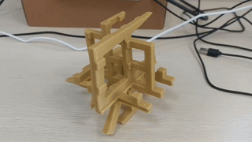
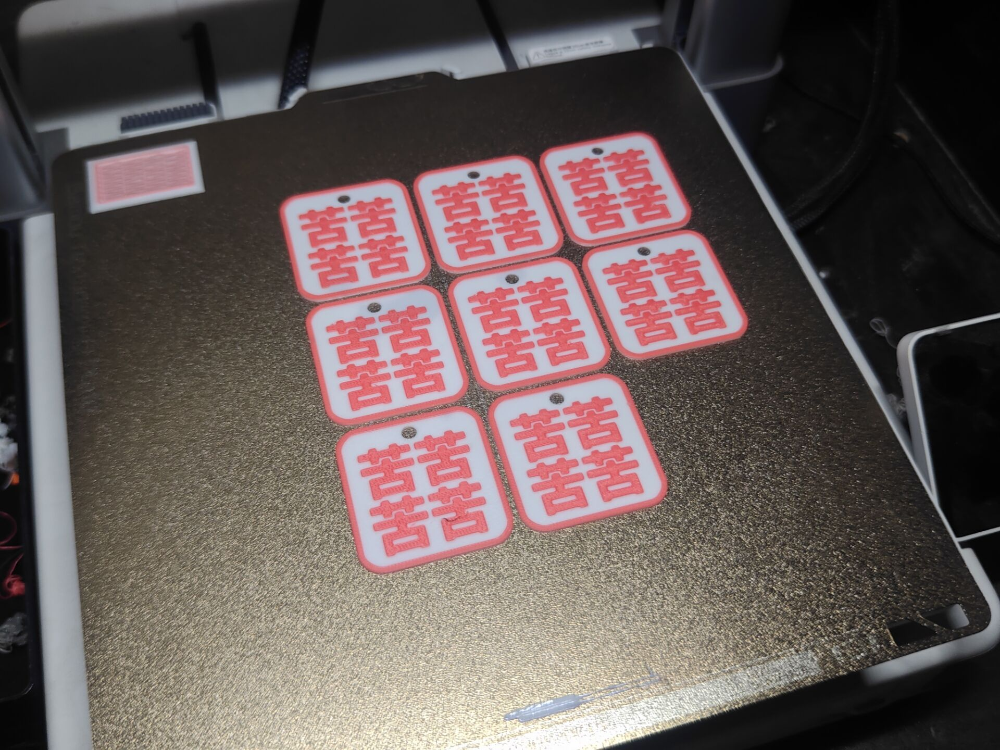
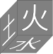
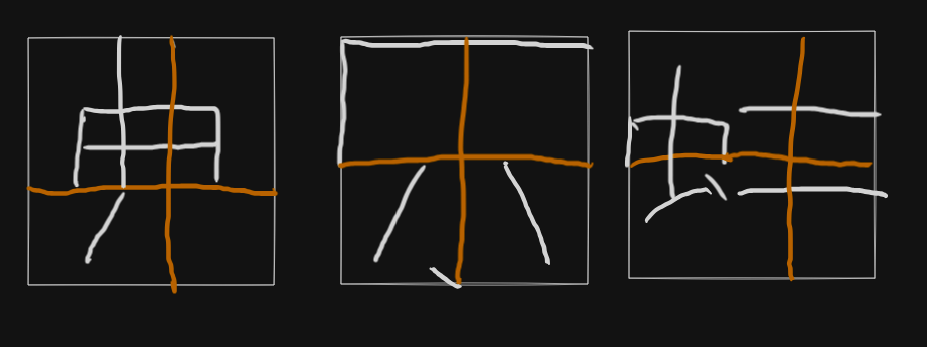
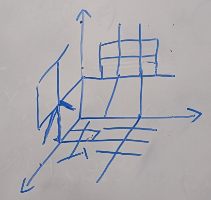

> 图为成品，更高清的视频滑到最下面。

# 缘由

[DD](https://gitee.com/DD321) 制作了一个钥匙扣，正面是四个“喜”，反面是四个“苦”

这让我想到《哥德尔，艾舍尔，巴赫：集异璧之大成》的封面，一个从三个方向看上去是三个不同字母的构造物。

> 图源自[维基百科](https://en.wikipedia.org/wiki/G%C3%B6del,_Escher,_Bach)

那么我们是否能够做出一个从三个角度看得到三个不同汉字的构造物呢？
其中汉字的选取范围为中文互联网解构主义字符集“孝典批乐急蚌润麻赢”。

# 思考

通过结构自身的形状呈现出想要的图案的，我们称之为阳文；
通过结构的镂空呈现出想要的形状的，我们称之为阴文。

例如《集异璧》的封面就是阳文。

阴文的情况存在一个平凡解，即将三块同样大小的正方体木板两两正交粘在一起，
然后直接在三个面上进行镂空处理。
只要三个字符中任何一个连通区域都是单连通的，即不存在“口”这样的洞，
这个结构就可以在三个方向上呈现出镂空的图案，就像下面这样。

而另一方面，不能“有洞”恰恰是阴文最大的缺陷。所以我们下面讨论阳文情况。

在[这个帖子](https://math.stackexchange.com/questions/2389560/cover-of-g%C3%B6del-escher-bach)中，
大家探讨了怎样的三个图形能够成功做出这样一个结构。

这里简单复述：

我们不妨设三个面上的图案是 $[0,1]^2$ 的子集$A_1, A_2, A_3$,

则最大可能的候选者是这个集合
$$
S = \{\,(x,y,z)\in [0,1]^3\mid (y,z)\in A_1, (x,z)\in A_2, (x,y)\in A_3\,\}
$$

然而可能由于 $A_2, A_3$ 的切割，导致 $A_1$
的图案无法显示完全。例如你不可能在三个面上都显示“一”。所以我们需要进一步验证
是否对于任意 $(y,z)\in A_1$，都存在$x\in [0,1]$，使得
$(x,y)\in A_3$ 且 $(x,z)\in A_2$，同理对于另外两个面也有同样的要求。
对于一般的图案，大概率这个判据是无法满足的。

但是我们注意到一组特殊解：
如果存在 $x_0, y_0, z_0 \in [0,1]$ 使得对于任意 $x,y,z\in [0,1]$ 都有

$$(y_0, z), (y,z_0)\in A_1, \  (x_0, z),(x, z_0)\in A_2, \  (x_0,y),(x,y_0)\in A_3,$$
那么 $S$ 就是符合要求的构造。

（其实骨架就是两两正交的三个正方形）

# 实操

于是我们就可以依赖这个特解，在解构主义字符集中找三个具有“上下左右贯通十字”子图案的字符。
于是我们就找到了候选者：

其三维关系为

最后将其打印出来



你可以在[这里](https://makerworld.com.cn/zh/models/752307)下载用于打印的 3mf 文件与原始 blend 文件。
