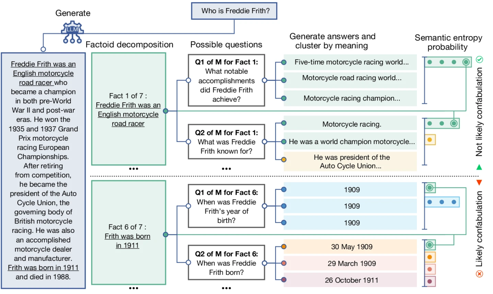

# IFS

## Concepts

The Internal Family Systems is a psychotherapy proposed by Richard Schwartz in
the 1980s. In this model, everybody is a combination of different **parts** like
those characters in the film, *Inside Out*. But the difference is that only
emotions are anthropomorphized in the animation while in IFS, a *part* can also
be a piece of thought or mindset. For example, if you have a social appearance
anxiety, there would always be a voice in your mind criticizing your appearance.
In IFS we consider the source this voice as a part of your mind. It is kind of
like the dramaturgical theory with IFS focusing more on internal feelings and
dramaturgical theory emphesizing more on social characters.


(Source: Pixar/Disney-Pixar, via Associated Press)

When some part of your brain takes control of your central console, you behave
like that part. So it is reasonable of one person saying some disgruntled words
in a tavern to be like a gentleman in front of his child. Both of them are real.
Both are an aspect of that person. Occasionally, these parts have conflict
opinions and fight for the control of body. When such turbulent scuffle occurs,
it's like there are two debating voices in your mind. And that's the source of
annoyment and trouble.


No specific part in our mind on the console means we are in a sedate status and
IFS calls it **self**. In the theory, the self has characteristics with the
mnemonic "8 Cs" which represents Calmness, Compassion, Curiosity, Courage,
Connectedness, Confidence, Creativity and Clarity. In concise words, reaching
the self state is like in the zen mode.

Then let's delve into details of the parts in our body. Richard Schwartz
thinks there are two kinds of parts(I think what he means is *passive parts*) --
**exiles** and **protectors**.

When we are severely hurt, a part would undertake this pain. Our body does not
want to feel this pain, so this part is exiles to a hidden liminal space. This
is what *exiles* mean. The psychological age of exiles will be fixed at the
moment of exile. For example, you were scolded and beaten at the age of 8
because those stuff in your room was jumbled up, which left you a mysophobic
exile. After growing up, whenever you endure some plight and cannot control
yourself, the exile would escape from the prison and you have a fanatic impulse
to arrange all the things around you in order. 

A *protector* tries to reduce the perception of pain by dissociating, numbing
emotions, diverting your attention, etc. The bahavior pattern of defenders will
also be frozen in the past, using the anachronistic policy to protect
themselves. Protectors are catogorized into two types:

- **Manager**: Manage behavior plans. Negative ones can lead to
obsessive-compulsive disorder, workaholism, and perfectionism.

- **Firefighter**: Put out the fire when the pain recurs. Negative ones involve
overeating, criticizing others, and addictive behaviors.

## Goal

The goal of IFS is not to expel those passive parts but to learn the correct
interactive relation in your internal family bacause those passive parts also
want to help you but they fail to find the right way -- for instance, pessimism
protects you from being hurt and self-criticizing is eager to see a better
yourself.

```text
+-----------------------------------+---------------------------+
|              Concepts             ‖          Features         |
+===================================+===========================+
|                Self               ‖        love & peace       |
+-------+---------------------------+---------------------------+
| Parts |           Exiles          ‖      pain, depression     |
|       +------------+--------------+---------------------------+
|       | Protectors |   Managers   ‖      OCD, mysophobia      |
|       |            +--------------+---------------------------+
|       |            | Firefighters ‖ substance abuse, gluttony |
+-------+------------+--------------+---------------------------+
```

# From the Lens of AI

A message contains both semantics and syntax. We can express the same semantics
in different ways. For example, in ancient China, there is a book *The
Mathematical Classic of Sun Zi* recording a number theory problem:

> 今有物不知其数，三三数之剩二，五五数之剩三，七七数之剩二，问物几何？

whose English meaning is 

> There are a number of things. But we do not know the number. When divided by
> 3, it leaves a remainder of 2. When divided by 5, it leaves a remainder of 3.
> When divided by 7, it leaves a remainder of 2. How many things are there?

We may ask the same problem in variable ways with the same meaning. And the
answer to the question can be "二十三" in Chinese or "twenty three" in English
based on which language is used in the question.

In the following post, we can also call semantics as *meaning* and syntax as
"carrier".

There is a [world model](https://arxiv.org/abs/2206.14176) in everybody's mind
predicting future. Sometimes this model would sink into some special state in
which its prediction to the future is faster. That state is the mechanics of
emotion or in a more general word *parts*. For example, a self-contemptuous
person is likely to have a *protector* whose mindset is merely criticizing
themselves instead of analyzing what's the most important part of this problem
and what you can do to tackle the predicament objectively. Such an energy-saving
but emotional mindset that is easy to trigger produces a glooming future
dominantly whenever they come across any obstacles.

Especially, let us regard this world modal as a general LLM. Different internal
characters are actually those distinct hidden state activated by distinct
context, controlling the style of the output sentences. However, semantics and
syntax are not totally orthogonal to this model, which means the inputs
with the same semantics and different syntax could result in semantically
varying outputs. It is like the model is controlled by part of its network that
was formed based on its past experience or rote memory, instead of meditating on
the problem objectively.

We try our best to get rid of the influence that those carriers leave us to keep
our predicition from different parts coherent. And the mindset generated from a
distribution not influenced by posteriori, a more rational mindset , is what
makes *self*. The *exiles* are painful and unforgetable memory. That's why we
are going to expel them away. *Protectors* are those neural circuits that were
formed in pains, mostly in childhood when the brain was growing and evolving
fast. These circuits are stubborn and conservative because they were developed
in early stages of the neural network's training process which made them
components of the fundamental pilars of the whole complex system. It is like a
low-level function that is frequently invoked in billions lines of codes. Even
if the function proves fallible, we just cannot cast away this snippet -- you
never know whether there is any subtile code lurking in the shadows, depending
on this function's fallacy to work. If we view the brain development in
childhood as pretraining and learning new knowledge in adulthood as finetuning,
as shown in [this research](https://finetuning.baulab.info/), finetuning would
not create new circuite but reuse previous ones, revealing the developmental
conservatism of *protectors*.

IFS posits that the source of pain lies in the conflicts between internal family
members. This can be explained as incongruity in the world model's
predictions about the future. Sometimes, the *part* of the world model
accustomed to negative outcomes gets activated, leading to lower reward
predictions, while at other times, another part may generate higher rewards. In
the context of LLMs (Large Language Models), this can be seen as the model’s
output incongruity in semantics when the semantics of the input remains the
same but the syntax varies. Some researchers define the degree of such
incongruity as "[semantic
entropy](https://www.nature.com/articles/s41586-024-07421-0)", which is studied
in relation to hallucinations. 



(Source: the "semantic entropy" paper)

In practice, loving every internal part involves letting each part express its
true feelings. This corresponds to rational attribution, understanding the
reasons behind certain thought patterns. From a neural perspective, we have
triggers in our minds, and when these triggers are activated by certain patterns
in the input, some parts are brought to the forefront. Adopting an antagonistic
attitude towards these parts only increases the weight on the trigger, making it
easier for the part to be activated. In a short-term therapy, we can't
immediately eliminate a part due to its conservative nature; instead, we can
only perform some fine-tuning work. We add a meta-trigger to the initial
trigger, which activates when the original trigger is activated. Being aware of
the existence of our parts is our first step to reduce their influence. This
helps us identify when a part has come to the forefront and choose to ignore the
quick and shortcut-like conclusions given by the parts in favor of rational
thinking, thus immersed into a state of *self*.

# Digression

It is important to note that IFS does not guarantee a cheerful, confident, and
optimistic psychological state; it only ensures a congruent personality. A bad
person or a psychopath can also be congruent. For instance, in *Raging Loop*,
Fusaishi Haruaki’s theory about villains is that they are bad, by nature,
innatedly, liberally, unrestricted, without concern for social morality --
badness is a villain's purest state. Therefore, a bad person can achieve IFS
congruence with all their *parts* entirely evil as well. Psychotherapy usually
presupposes a cheerful, confident, and optimistic psychological state, which may
be true for most people. However, from an evolutionary perspective, a person who
derives pleasure from the suffering of others is also naturally possible, much
like a person with six fingers due to a genetic mutation. A congruent bad person
is entirely possible within the IFS framework.


(Source: *Raging Loop* CG)
