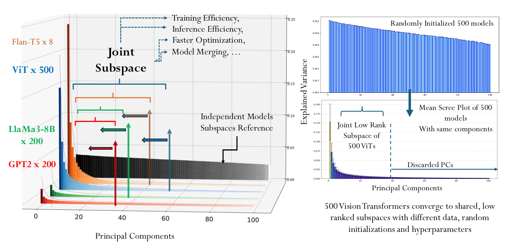
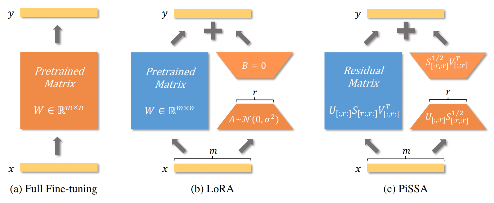
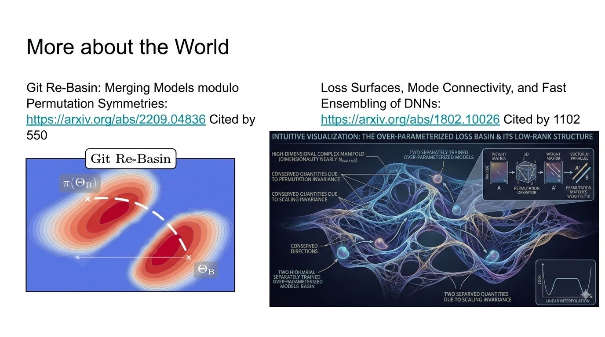
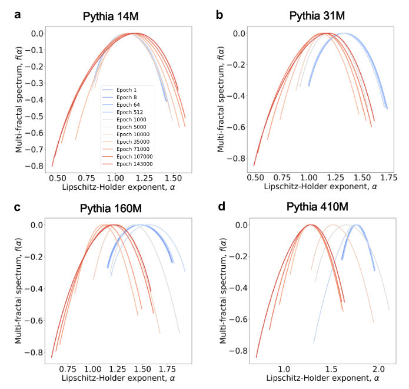
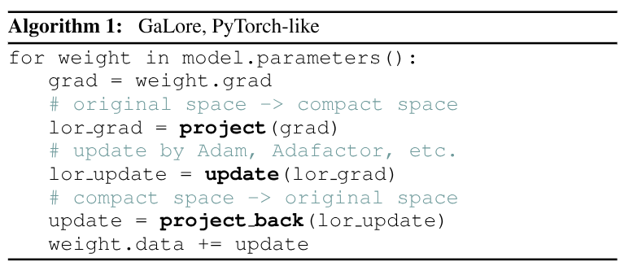
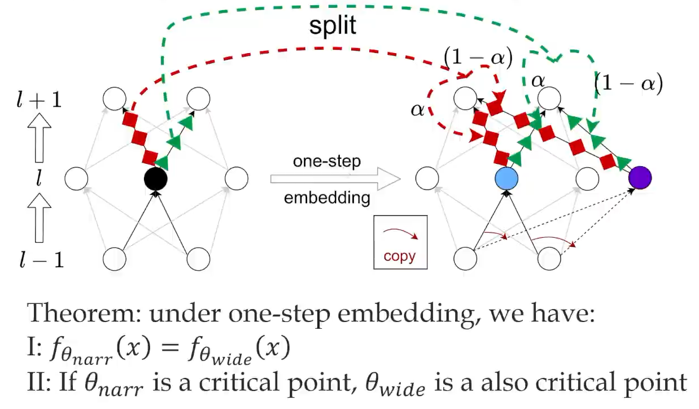

I use **the Neural Matthew Effect** to describe a recurring pattern in deep network training: a small number of directions, modules, or connections carry most of the learning signal. In parameter space, this appears as **low-rank updates**; in gradient space, as concentration along **dominant directions**; at the functional level, as the strengthening of existing **circuits**; and at the structural level, as increasingly uneven interactions among neurons.

Throughout this article, **low rank** does not mean strictly low algebraic rank. It means **low effective rank**. For neural network weights, gradients, and the **Hessian**, strict rank is often unstable: an arbitrarily small perturbation can turn a matrix into full rank, but that does not mean all directions are equally important. The more useful question is not "how many singular values are nonzero?", but "how many directions contain most of the spectral mass?"

There are several common ways to define effective rank. The first is **energy rank**. Given a threshold $\epsilon$, define $r_\epsilon$ as the smallest integer such that

$$
\frac{\sum_{i=1}^{r_\epsilon}\sigma_i^2}{\sum_i \sigma_i^2} \ge 1-\epsilon .
$$

The second is **stable rank**:

$$
\operatorname{srank}(A)=\frac{\|A\|_F^2}{\|A\|_2^2}
=\frac{\sum_i \sigma_i^2}{\sigma_1^2}.
$$

It measures how much energy remains outside the largest singular value. The third is **entropy effective rank**. Let $p_i=\sigma_i/\sum_j\sigma_j$, then

$$
\operatorname{erank}(A)=\exp\left(-\sum_i p_i\log p_i\right).
$$

If a few singular values dominate, the entropy effective rank is small; if the singular values are nearly uniform, it approaches the true rank. The fourth is the **participation ratio**:

$$
\operatorname{PR}(A)=\frac{(\sum_i \sigma_i^2)^2}{\sum_i \sigma_i^4}.
$$

These definitions do not have to produce identical numbers, but they answer the same underlying question: how many effective directions does training actually use?

## A Good Story

**The Universal Weight Subspace Hypothesis**[^1] argues that although large language models may differ in training data, architecture, and even optimization strategy, the core knowledge and representations they learn may collapse into a shared, extremely low-dimensional subspace.

The left panel above can be understood as follows. Start with a base model and fine-tune it with **LoRA** on multiple downstream tasks. For the $i$-th task, the parameter update is

$$
\Delta W_i = W_i - W_0 .
$$

Flatten each $\Delta W_i$ into a vector

$$
v_i=\operatorname{vec}(\Delta W_i)\in \mathbb{R}^P,
$$

where $P$ is the number of model parameters. With $n$ tasks, we obtain the matrix

$$
M=[v_1,v_2,\dots,v_n]\in \mathbb{R}^{P\times n}.
$$

Running **PCA** on $M$ amounts to asking which directions in parameter space contain most of these task updates. The result is striking: the largest dozen or so principal components already explain most of the parameter change. This leads to an appealing interpretation: the knowledge learned by deep networks is not scattered across all corners of parameter space, but lies in some universal, shared, low-dimensional **knowledge subspace**.

## The Turn

But is that really what the evidence shows? One obvious issue is that the claimed **subspace** is defined relative to the same initialization. A more direct explanation might be this: under the same initialization $W_0$ and similar training settings, different fine-tuning updates $\Delta W_i$ mainly fall into a small number of effective directions induced jointly by that initialization, the data distribution, and the local curvature. This does not automatically imply that different initializations or different architectures share the same **universal weight subspace**.

There is a more modest story.

After pretraining, the weights $W_0$ often sit near a high-dimensional flat region of the loss landscape. Around that point, the **Hessian** typically has low effective rank: a few large eigenvalues correspond to highly sensitive directions, many near-zero eigenvalues correspond to extremely flat directions, and a small number of negative eigenvalues may also appear, suggesting that the point is closer to a saddle region than to an isolated minimum. During fine-tuning, gradient descent therefore tends to move first along the few high-curvature, high-response directions. If different downstream tasks share the same pretrained initialization, their parameter updates naturally concentrate in similar effective subspaces.

This leads to a simple engineering idea: instead of initializing **LoRA** completely at random, use the dominant singular directions of the pretrained weight matrix itself to initialize the low-rank adapter. This is the core idea behind **PiSSA**[^2]. Compared with standard LoRA, it converges faster and, at the same rank, achieves better final performance on some tasks.

Does that mean the supposed subspace does not exist at all? Not quite. At least among models with the same architecture and similar training trajectories, a low-dimensional effective subspace is quite natural. The problem is that the weight-subspace argument is too strong about "universality" and too quiet about initialization and training-path constraints. A more reasonable statement is that **low-rank structure** can arise naturally from the local geometry of overparameterized networks.

The loss landscape of **overparameterized networks** contains many approximately flat directions, which may come from scaling symmetries, permutation symmetries, and similar structures. The directions that significantly affect the function output occupy only a small part of parameter space, so the effective degrees of freedom used during training are far smaller than the total number of parameters. One can imagine the flat directions as a high-dimensional skeleton, while the gradient mainly moves along a few transverse directions that actually change the function. In short, relative to the local flat skeleton, the gradient only sees a low-dimensional **effective cross-section**, so the update appears low-rank.

A related phenomenon is that two overparameterized models trained from random initializations can often be matched by a neuron permutation[^5]. After this permutation, linear interpolation between their weights can preserve model performance. This suggests that many apparently different parameter points may actually lie in the same broad, connected low-loss region.

Visually, this resembles the **cosmic web**. Of course, this is only a metaphor for intuition, not a proof.



The white dots represent full galaxies, and the filamentary structures show where matter exists. The simulated region is a cube 437 million light-years on each side, and the camera moves at about 600 trillion times the speed of light. *Visualization: Frank Summers (STScI); Simulation: Martin White and Lars Hernquist, Harvard University.*

## Related Work

Deep network training does not use all parameter degrees of freedom uniformly. Instead, learning signals tend to concentrate in a small number of effective directions, modules, or connection patterns. Different lines of work have observed this kind of **concentration** in parameter space, gradient space, curvature space, functional circuits, and neuron-interaction networks. I call the general pattern "a few directions or modules carrying most of the change and function" the **Neural Matthew Effect**. Several examples are:

- **Circuits**: In Transformers, a circuit is a collection of modules that work together to implement a specific function, with information flow that resembles an electrical circuit. The Transformer Circuits framework[^6] provides a systematic analysis. Fine-Tuning Enhances Existing Mechanisms: A Case Study on Entity Tracking[^7] shows that task fine-tuning often improves LLM performance not by creating entirely new circuits, but by strengthening and reconfiguring circuits already present after pretraining. A related view is that the model reuses similar components while changing the strength and pattern of information flow among them[^15].

- **Lottery Ticket Hypothesis** (**LTH**)[^17]: A randomly initialized large neural network may already contain small subnetworks. If trained in isolation, these subnetworks can reach performance close to that of the full model.

- **Multifractal Analysis**: Neuron-based Multifractal Analysis of Neuron Interaction Dynamics in Large Models[^8] shows that as training progresses, the multifractal spectrum of the model's internal interaction network gradually widens, indicating increasing heterogeneity in connection patterns. The spectrum also shifts leftward, meaning the irregularity index decreases and sparsity increases. There is a useful visualization here[^9]. Similar spectral changes often appear around crises or phase transitions, such as the S&P 500 before and during the 2008 financial crisis, DDoS traffic patterns, and energy fluctuations before earthquakes.


<iframe
  title="Interactive Demo"
  width="100%"
  height="500"
  style="border: 1px solid var(--border); border-radius: 8px;"
  sandbox="allow-scripts"
  srcdoc="
<!DOCTYPE html>
<html lang='en'>
<head>
    <meta charset='UTF-8'>
    <title>Multifractals: Crisis Evolution Simulator</title>
    
    
</head>
<body>

    <h2>Dynamic Evolution Model of the Multifractal Spectrum</h2>

    

        <label style='font-size: 1.1em;'>
            <strong>System Crisis Index K (0 = calm, 1 = extreme turbulence): </strong>
            0.10
        </label>
        <input type='range' id='kSlider' min='0' max='1' step='0.01' value='0.1'>
        

            <strong>How to use it:</strong> Drag the slider to the right. Watch how the upper time series shifts from a stable random walk to extreme oscillations. At the same time, observe how the lower f(alpha) spectrum shows a characteristic <strong>leftward shift, indicating increased overall roughness</strong>, and <strong>width expansion, indicating stronger local intermittency</strong>.
        

    

    

        

    

    

        

    

    
</body>
</html>
">
</iframe>


Together, these results point to the same picture: neurons, connections, and submodules inside a model gradually move from near-equality at initialization toward inequality. **Circuits** emphasize functional specialization after training. **LTH** suggests that part of this inequality already exists at initialization. **Multifractal analysis** shows how this differentiation unfolds through neuron-interaction networks during training.

## Applications

If this concentration phenomenon is common, we can exploit it.

On the engineering side, **GaLore** (**Gradient Low-Rank Projection**)[^10] periodically computes the leading left and right singular vectors of the full gradient matrix. The optimizer then only needs to store the low-dimensional matrix $\tilde{G}_{t+\Delta t} = P_t^T G_{t+\Delta t} Q_t$, reducing memory usage.

So far, we have discussed low rank in the gradient matrix during backpropagation. A natural next question is whether the parameter matrix used in the forward pass can also be kept low-rank. Let $G = \frac{\partial L}{\partial W}$. The standard full update is $\Delta W = -\eta G$. Now consider the low-rank factorization $W=AB$. Differentiating gives

$$
\nabla_A = G B^T,\qquad \nabla_B = A^T G.
$$

Thus

$$
W_{\text{new}}
= (A-\eta\nabla_A)(B-\eta\nabla_B)
= (A-\eta G B^T)(B-\eta A^T G).
$$

Ignoring second-order terms, the change in $AB$ is approximately

$$
\Delta(AB)\approx -\eta(GB^TB + AA^TG).
$$

If we do not want the dynamics to be distorted by pathological scaling between $A$ and $B$, we usually want the columns of $A$ and the rows of $B$ to be approximately orthogonal, i.e. $A^T A\approx I_r$ and $BB^T\approx I_r$. This can be enforced with **RGD on the Stiefel manifold**, or by adding orthogonality regularizers such as $\|A^TA-I\|_F^2$ and $\|BB^T-I\|_F^2$.

Another route is **ReLoRA** (**High-Rank Training Through Low-Rank Updates**)[^11], which repeatedly reinitializes and merges LoRA updates. Intuitively, random low-rank subspaces in sufficiently high dimensions are often close to orthogonal. By repeatedly switching subspaces, a sequence of low-rank updates can accumulate a higher-rank training effect.

In theory, the **low-rank** nature of gradients can also simplify analysis. Instead of tracking the entire matrix, one often only needs to follow a few principal components. For example, when spectral mass is highly concentrated, the nuclear norm and spectral norm can be treated as being of the same order, $\|\nabla_W L\|_*=\Theta(\|\nabla_W L\|_2)$. This kind of approximation can be used in derivations of **muP** from the spectral norm perspective[^16].

## Explaining the Phenomenon

There are several ways to understand this phenomenon.

### NTK

From the perspective of the **Neural Tangent Kernel** (**NTK**), if LoRA or fine-tuning only changes parameters modestly, the model dynamics are dominated by the largest few eigenvalues of the NTK. Low-rank behavior is therefore unsurprising. In the NTK regime, the time evolution of the network output can be approximated by a linear dynamical system:

$$
\frac{df(X)}{dt}=-\eta \Theta \nabla_{f(X)}L.
$$

Decompose $\Theta$ as $\Theta=U\Lambda U^T$, and define $\widetilde{f(X)}=U^Tf(X)$. Then

$$
\frac{d\widetilde{f(X)}}{dt}
=-\eta\Lambda\nabla_{\widetilde{f(X)}}L.
$$

Thus, the convergence rate of each mode is determined by the corresponding NTK eigenvalue in $\Lambda$. Large eigenvalues correspond to fast-learning directions; small eigenvalues correspond to slow, nearly frozen directions. When the spectrum is concentrated in a few large eigenvalues, training naturally has **low effective degrees of freedom**.

The same idea can be phrased in the language of **Gauss-Newton** or **Fisher** matrices. Let the parameters be $\theta$, the model output on the training set be $f_\theta(X)$, and the Jacobian be

$$
J=\frac{\partial f_\theta(X)}{\partial \theta}.
$$

If $g=\nabla_{f(X)}L$, then the parameter gradient is

$$
\nabla_\theta L=J^Tg,
$$

and the gradient flow in output space is

$$
\frac{df(X)}{dt}
=J\frac{d\theta}{dt}
=-\eta JJ^Tg.
$$

Here, $JJ^T$ is precisely the empirical NTK. On the other hand, the **Gauss-Newton** matrix is usually written as

$$
G_{\mathrm{GN}}=J^T H_\ell J,
$$

where $H_\ell$ is the Hessian of the loss with respect to the model output. The **Fisher** matrix has a similar form:

$$
F=\mathbb{E}[J^T S J],
$$

where $S$ is a local metric induced by the output distribution. In other words, NTK, Gauss-Newton, and Fisher are all governed by the same Jacobian $J$ together with a local metric in output space. NTK looks at $JJ^T$ in output space; Gauss-Newton and Fisher look at $J^T H_\ell J$ or $J^T S J$ in parameter space. Under squared loss, or when the local metric is approximately stable, their dominant directions can all be understood through spectral concentration in the same Jacobian, or in the weighted Jacobians $H_\ell^{1/2}J$ and $S^{1/2}J$. Thus, "a few dominant directions drive training" can be described either as concentration in the NTK spectrum or as low effective rank in the Gauss-Newton/Fisher matrices.

### Weight Decay

**Weight decay** can induce low rank through two main intuitions.

- For a matrix, weight decay corresponds to **Frobenius norm** regularization, which regularizes the magnitudes of singular values. Since each gradient update may itself be low-rank, and old updates are gradually erased by weight decay, it is natural to imagine an upper bound on effective rank. That bound is usually very loose[^12].
- Note that

$$
\min_{W_k\cdots W_1=W}
\frac{1}{k}\sum_{i=1}^k\|W_i\|_F^2
=\|W\|_{S_{2/k}}^{2/k}.
$$

Therefore, optimizing a deep linear network with weight decay is equivalent to imposing a **low-rank bias** on the end-to-end map. The deeper the network, the stronger this tendency becomes because of the $S_{2/k}$ quasi-norm. See [^13] for details.

### Embedding Principle

The **Embedding Principle**[^14] states that when a smaller subnetwork is embedded in a wider network, it corresponds to a more degenerate region: the Hessian has a larger multiplicity of zero eigenvalues, more flat directions, and a larger volume in parameter space. Training is therefore more likely to enter these regions induced by small subnetworks and obtain performance gains. This is similar in spirit to **LTH**: the wider the network, the more likely it is to contain effective subnetworks.

### Dropout

**Dropout** can induce a weighted $L_2$ norm, and we have already discussed how weight decay can create a low-rank bias. Consider linear regression:

$$
L(w)=\frac{1}{2}(y-w^Tx)^2,
$$

where the dropout-corrupted input is

$$
\tilde{x}_i=x_i\frac{\xi_i}{p}.
$$

Then

$$
\mathbb{E}_\xi[L_{\mathrm{drop}}(w)]
=\mathbb{E}_\xi\left[\frac{1}{2}(y-w^T\tilde{x})^2\right]
=L(w)+\frac{1-p}{2p}\sum_{i=1}^d w_i^2x_i^2.
$$

In this simple setting, dropout is equivalent to a data-dependent weighted $L_2$ regularizer. When this kind of regularization acts on matrix parameters, it can further strengthen the tendency toward low effective rank by suppressing spectral mass in less important directions.

## Summary

The discussion above can be compressed into the following table.

| Level | Representative Work or Phenomenon | What It Studies |
| --- | --- | --- |
| **Parameter level** | **LoRA** updates, **Universal Weight Subspace**, **PiSSA**, **GaLore** | $\Delta W$, $\partial L/\partial W$, weight spectra, etc. |
| **Functional level** | **Circuits** | Which attention heads, MLP neurons, edges, or paths implement a task |
| **Structural-statistical level** | **Neuron-based Multifractal Analysis** | Heterogeneity and organization of neuron-interaction networks |
| **Sparse-subnetwork level** | **Lottery Ticket Hypothesis**, **Embedding Principle** | Trainable or inheritable sparse substructures inside the network |

## References
[^1]: [The Universal Weight Subspace Hypothesis](https://arxiv.org/abs/2512.05117)
[^2]: [PiSSA: Principal Singular Values and Singular Vectors Adaptation of Large Language Models](https://arxiv.org/abs/2404.02948)
[^3]: [CorDA: Context-Oriented Decomposition Adaptation of Large Language Models](https://arxiv.org/abs/2406.05223v3)
[^4]: [MiLoRA: Harnessing Minor Singular Components for Parameter-Efficient LLM Finetuning](https://aclanthology.org/2025.naacl-long.248)
[^5]: [Git Re-Basin: Merging Models modulo Permutation Symmetries](https://arxiv.org/abs/2209.04836)
[^6]: [A Mathematical Framework for Transformer Circuits](https://transformer-circuits.pub/2021/framework/index.html)
[^7]: [Fine-Tuning Enhances Existing Mechanisms: A Case Study on Entity Tracking](https://arxiv.org/abs/2402.14811)
[^8]: [Neuron-based Multifractal Analysis of Neuron Interaction Dynamics in Large Models](https://openreview.net/forum?id=nt8gBX58Kh)
[^9]: [Multifractal Analysis Visualization](multifractal.html)
[^10]: [GaLore: Memory-Efficient LLM Training by Gradient Low-Rank Projection](https://arxiv.org/abs/2403.03507)
[^11]: [ReLoRA: High-Rank Training Through Low-Rank Updates](https://arxiv.org/abs/2307.05695)
[^12]: [SGD and Weight Decay Secretly Minimize the Rank of Your Neural Network](https://arxiv.org/abs/2206.05794)
[^13]: [Representation Costs of Linear Neural Networks: Analysis and Design](https://proceedings.neurips.cc/paper/2021/hash/e22cb9d6bbb4c290a94e4fff4d68a831-Abstract.html)
[^14]: [Embedding Principle: a hierarchical structure of loss landscape of deep neural networks](https://arxiv.org/abs/2111.15527)
[^15]: [Towards Understanding Fine-Tuning Mechanisms of LLMs via Circuit Analysis](https://openreview.net/forum?id=45EIiFd6Oa)
[^16]: [A Spectral Condition for Feature Learning](https://arxiv.org/abs/2310.17813)
[^17]: [The Lottery Ticket Hypothesis: Finding Sparse, Trainable Neural Networks](https://arxiv.org/abs/1803.03635)
