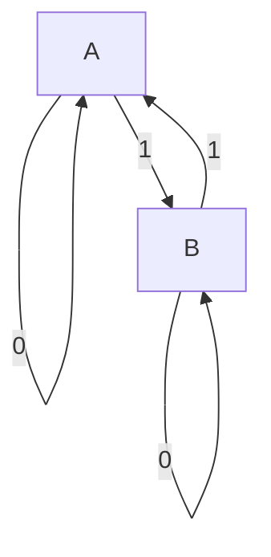
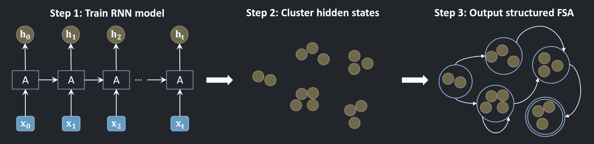
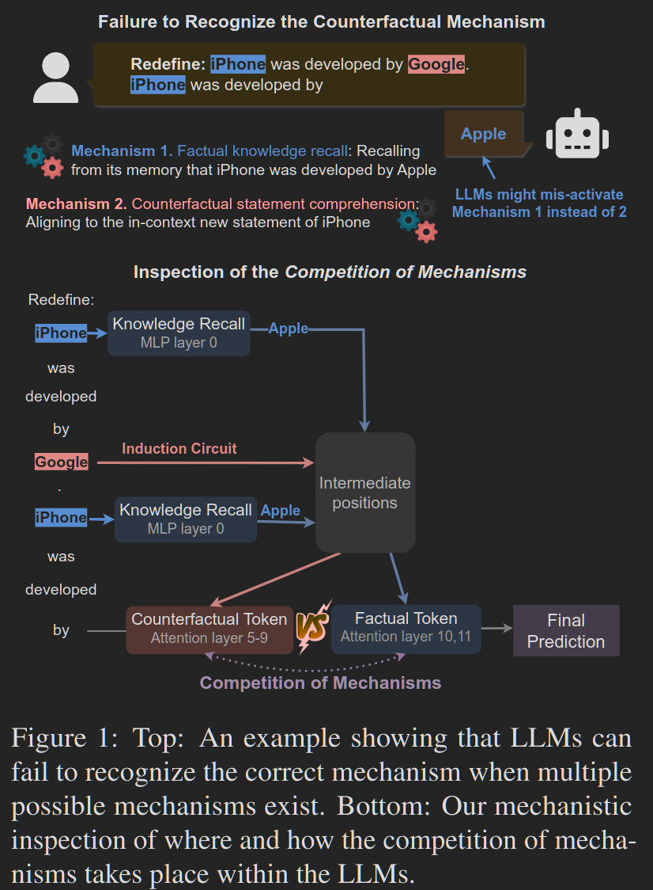
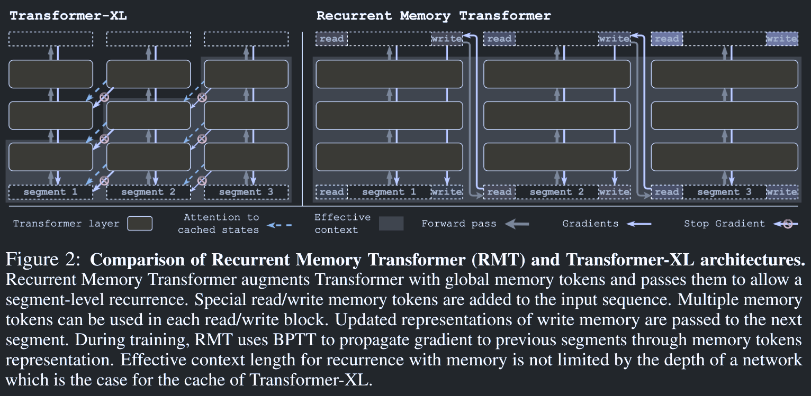
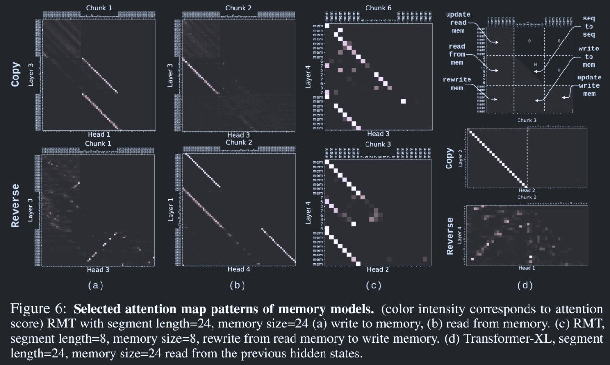

Classified by their duration, there are at least three kinds of memory in human:
Working Memory(WM), Short-Term Memory(STM) and Long-Term Memory(LTM).

WM can be seen as the internal states of the system that varies across the
entire process. STM can be thought of as the memory for a milestone or key
objects in a multi-stage task. And finally, LTM can be conceived as the neural
network itself. The persistent knowledge is embedded in the architecture per se. 

In this article, we would mainly focus on WM.

# Semiautomata where Transformer fails

In order to corroborate the belief of the indispensable role of WM, a category
of tasks called "procedural tasks" are introduced in the next subsection. Then
the internal mechanism of RNN and Transformer on this task is explained with the
support of some papers. Given the conspicuous contrast in the performance of RNN
and Transformer, by reviewing their architecture, their different ways of
treating memory could be possibly a significant factor that attributes to the
gap, thus highlighting the importance of WM.

As for the aforementioned tasks, Although RAG and other engineering helps
improve the performance on these tasks, the point is not the performance or a
task itself, but the inherent incompetence of Transformer.

Different tasks evaluate different ability of an intelligence system. Many of
them are real problems like object detection, text continuation, e.t.c. But they
blend multiple factors togetehr. They entangle too many factors in the
evaluation. For example, text continuation might not only
requres the ability to grasp the main idea of the whole passage(emotion
classification) but the potential to manipulate tokens precisely as well(in math
problems). A **general** intelligence should not only performs well on one
dimension but fails on another dimension. What makes real task evaluation worse
is that sometimes the weakness is lurking under the hood of the advantages. For
example, imagine a model has a retentive memory but little logical thinking
ability. The model is able to perform as if it knows how to addition and
substraction of numbers less than one hundred by rote learning all possible
calculations in the training dataset. However, when it is given additions of
numbers larger than 100, it would definately be baffled and output some
mearningless random digit.

You might argue that "isn't it the fault of data shifting that's to be blamed
for the misbehavior of the model?" Of course, by means of enlargening the
parameters of the model, collecting or generating more data, utilizing chain of
thoughts, all of them successfully mitigate the problem without any doubt. But
as far as what we really concerned, the point is never the quantitative
indicators of the task in industry or real life, but the deficiency of logic.
Even if you perfectly solves the "233 + 333" problem, what's it like if input
turns into "1428 + 5714"? Even you solve the problem of all the arithmetic
calculation using an external tool, can you ensure that the model would give a
correct decision to stop the throttle when your car is trapped in the wet
concrete pavement instead of attempting to step on the gas fully, accelerating
the car given the low velocity provided by the sensor? Would you believe an AI
assistant based on LLM which regards "3.11 > 3.8"?

## Working Memory in Procedural Tasks

Transformer-based language models excel at popping up the most appropriate
prediction of the next token given an overview of the context, which endows them
with the predominance on perceptual tasks like emotion detection, text
classification and text summarization. However, there is another type of tasks
diverging from what is required in that perceptual task a long way, procedural
tasks, including arithmetic calculation and multi-hop reasoning. LLMs' lack on
such tasks compared to even a human child unravels the innate defect in their
architecture of Transformer.

Formally, a procedural task is defined as a task that is governed under a finite
state machine(FSM). For example, let's consider a parity check task in which the
input is a 0-1 sequence and the model is required to output the parity of 1s in
the sequence. The corresponding FSM can be illustrated as

If a model implements this FSM internally, it would definately performs well on
this task.

### RNN: the Sequential Way

RNN is structural suitable for procedural tasks. They implicitly
model the states of an FSM in its hidden representations and the transition
between states is learned by the update of hidden representations. Actually, you
can uncover the internal FSM using PCA followed by a discretization as in [this
paper](https://doi.org/10.1145/3338906.3338954) or using some clustering methods
as shown in [this paper](http://arxiv.org/abs/1810.10708).

> This figure from "Learning with Interpretable Structure from Gated RNN"
> illustrate their proposed algorithm.

### Transformer: the Paralell Way

Transformers lead another way to solve this problem: summing up all the figures
and do a modular operation like $(\sum_ {i=1}^n a_ i) \ \text{mod} \ 2$. To
understand how this is possible, we are going to dabble in the mechanism of a
Transformer. Transformer reasons by
[circuits](https://transformer-circuits.pub/2021/framework/index.html). Tokens
interacts with each other in the attention layers during which information flows
between distinct tokens. And a token is transformed, strengthened, or retrieved
into another token in the MLP layer.

> By the way, in [Transformer Circuits
> Thread](https://transformer-circuits.pub/), you can find many interesting
> articles related with interpretability that is worth reading.

An demonstration about circuits is excerpted from [this
post](https://www.lesswrong.com/posts/CJsxd8ofLjGFxkmAP/explaining-the-transformer-circuits-framework-by-example).

In a task of finding the maximum of the input number, the attention map is
illustrated. The end token up till now pays more attention to the maximum number
by far so that the maximum token is transported from its original location to
the current token. Given the input of "46 41 41", the Transformer should turn
the last token from 41 to 46. As shwon in the diagram, the last "41" token in
the model actually attends to "46" more than other tokens, which is consensus
with our expectation.

Following this line, researchers start to investigate Transformers in depth. For
example, in [this work](http://rome.baulab.info/), the facts and knowledges are
located in some MLP layer by causal mediation analysis.

> The figure is from the project page of the paper "Locating and Editing Factual
> Associations in GPT". By cutting off the information flow in the model, they
> figure out which module is critical to the correct output, which turns out to
> be the MLP layer. They further corroborate their statement by means of editing
> the targeted MLP to distort the knowledge of LLMs.

Another example is that in [this work](http://arxiv.org/abs/2402.11655), the circuit for the competition
of fact and couterfactuals are uncovered using logit lens and attention
modification.

> Figure from "Competition of Mechanisms: Tracing How Language Models Handle
> Facts and Counterfactuals"

If memory components are added, it could mitigate Transformer's disadvantage on
procedural tasks. Using the technique of
[scratchpad](https://arxiv.org/abs/2112.00114) enbles Transformer to achieve
competitive performance compared to RNN. Similarly, a memory token can also
serve as an unsupervised scratchpad in [this
paper](https://arxiv.org/abs/2207.06881) at the sacrifice of paralell training.
The above method convinced us of the importance of WM.

Although [this paper](https://openreview.net/forum?id=De4FYqjFueZ) shows that
Transformer should have the ability to model a FSM theoretically, Transformer
fails to extrapolate to longer context potentially due to position embedding
correlation ,[attention dilution](https://arxiv.org/abs/2210.10340) and the
misfunction of MLP out of distribution. 

> Figure from the [project page](https://clarabing.github.io/shortcut_automata/)
> of "Transformers Learn Shortcuts to Automata" showing the construction of
> Transformer to simulate a semiautomaton.

# Models Augmented by Memory

The mainline of model designing for memory augmentation lies on the goal of
prolonging Transformer's limited context which is a notorious drawback of this
architecture. An early work in the field of augmenting Transformer with memory
is the [Compressive Transformer](http://arxiv.org/abs/1911.05507) which
compresses old memory to an compressed memory pool for retrospection.

> Figure from "Compressive Transformers for Long-Range Sequence Modelling"

The input is sliced into sequences. For example, in the figure above, every
sequence consists of 3 tokens. Every forward propogation, the sequence is
feed into the model attending to the past tokens(memory) and compressed memory.
the last few memory tokens is then compressed into a single compressed memory
token before being pushed to a fixed-sized circular queue (compressed memory
pool). The compressing function may varies from a hardwired meax/mean pooling to
a flexible small neural network. 

[Recurrent Memory
Transformer](https://arxiv.org/abs/2207.06881) modifies the standard Transformer
architecture to enable infinite memory. The reason why they put the read tokens
at the beginning of the segment and the write tokens at the end of the segment
is due to triangular attention map of the decoder-only Transformers. 

> Figure from "Recurrent Memory Transformer"

RMT outperforms its baseline(Transformer-XL without memory) on arithmetic tasks
like Copy, Reverse, Associative Retrieval, e.t.c. An issue with Transfromer-XL
is mixing the memory related tokens with current representations while RMT
mitigate the problem by introducing specific tokens for memory. RMT tackles this
by dedicated memory tokens. Although the input is compressed, the memory is
limited due to the fixed size of the compressed memory pool. RMT also suffers
from numeric issues in gradient rising from Back Propogation Through Time(BPTT)
like RNN as well. 

Despite RMT's exceptional behavior on simple arithmetic tasks, it is a pity not
to see its evaluation on more procedural tasks such as bit string parity check
and long multiplication.

The idea to have some memory token inspired a paper named "HMT: Hierarchical
Memory Transformer for Long Context Language Processing". In this paper, 
[Hierarchical Memory Transformer](https://arxiv.org/abs/2405.06067) imitates a
human's hierarchical memory.

> Figure from "HMT: Hierarchical Memory Transformer for Long Context Language
> Processing"

We see the similar design of having segment summarization prompt embedding on
both ends of the input token as we've seen in Recurrent Memory Transformer.
However, as for procedural tasks, previous source text is abandoned in a long
context. It would be better if the generated text is stored in an external
storage, like a log, in case the model needs detailed text instead of a
vague impression. Moreover, the input length of the model is fixed, which might
not be suitable for procedural tasks because of the "thinking complexity" of the
text varies. For example, you can read a popular novel by lines but you need to
check one figure once at a time in a bit string parity check problem. It is not
fair to assign the same think time for different styles of text.
