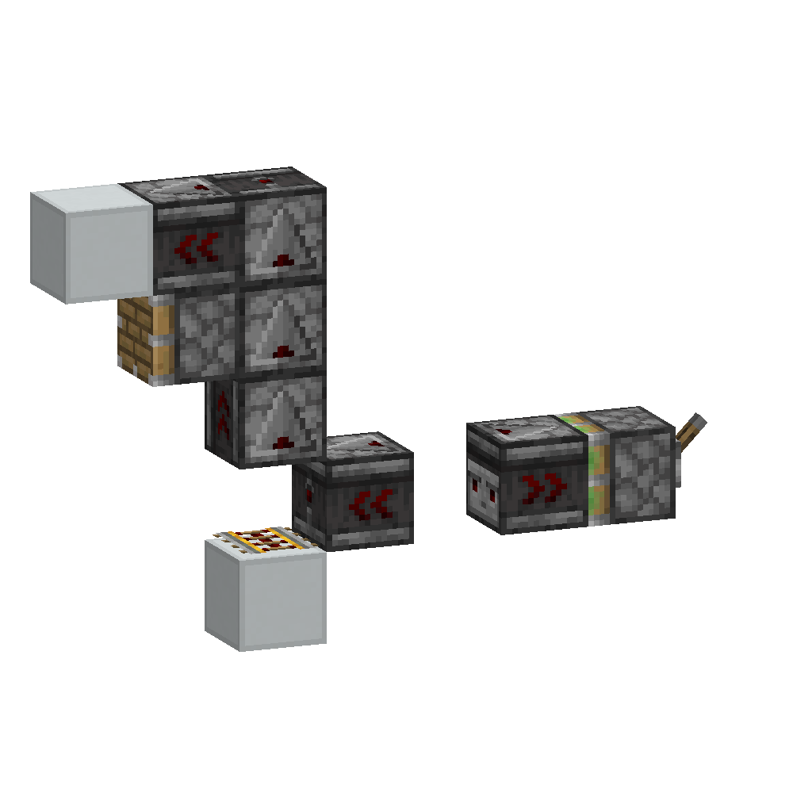

Scroll down to read the English version.

# 问题

你真的理解侦测器吗？

问题1：

为什么两个面对面的侦测器，如果是用活塞推上去的，
获得的就是4gt周期的1/2占空比的方波；而如果是手动放置的，
则是6gt周期的1/3占空比的方波？


> 上面一行的朝右侧的侦测器是手动放置的，而下面一行的朝右侧的侦测器是由活塞放置的

问题2：
来看下面这个机械，BUD活塞会活动吗？



如果是这样呢？BUD活塞还会活动吗？


如果你无法回答这两个问题，那么这篇文章就是你所找的。
这篇博文将会从源代码的层面刨根问底去解释侦测器的微时序行为。
文中的源代码是用[DecompilerMC](https://github.com/hube12/DecompilerMC)
默认配置生成的1.21.4的代码。


在读之前，你应该先对微时序有初步了解。[肥啾的这个视频](https://www.bilibili.com/video/BV1AZ4y1Y7pX)
和
[佛冷的博客](https://blog.fallenbreath.me/)都是不错的中文相关材料。
注意由于mapping与源代码的差异，在这些资料中对某个微时序称谓可能与本博客不同。
在本文关心的微时序中，命名差异见下表

| 上述材料中的命名 | 本文的命名 |
| --- | --- |
| NTE(Next Tick Entry) | TT(Tile Tick) |
| NU(Network Update) |  PA(Player Action) |

# 代码基础

> 太长不看版：
> 1. 计划刻不包含“要让侦测器变亮”或“要让中继器暗掉”这样的信息，
计划刻的行为逻辑是每个方块根据当前状态自己决定的。
例如同样是计划刻，亮的中继器执行则是熄灭，暗的中继器执行则是亮起。
> 2. 如果当前时刻有计划刻则侦测器首先会改变自己的状态，
之后给出对自己的毗邻方块给出PP更新，
再判断(如果新状态是亮起来，那么添加一个两个游戏刻后的计划刻；如果是暗掉，则不添加)，
然后NC更新自己屁股对着的方块，
之后对自己屁股对着的方块为中心的一阶邻域（不包括侦测器自己和屁股对着的方块）给出一个NC更新。

---

详细版：

如果侦测器在当前游戏刻有一个计划刻需要执行，则在Tile Tick阶段将会执行以下代码

```java
// net/minecraft/world/level/block/ObserverBlock.java
protected void tick(BlockState blockState, ServerLevel serverLevel, BlockPos blockPos, RandomSource randomSource) {
    if (blockState.getValue(POWERED).booleanValue()) {
        serverLevel.setBlock(blockPos, (BlockState)blockState.setValue(POWERED, false), 2);
    } else {
        serverLevel.setBlock(blockPos, (BlockState)blockState.setValue(POWERED, true), 2);
        serverLevel.scheduleTick(blockPos, this, 2);
    }
    this.updateNeighborsInFront(serverLevel, blockPos, blockState);
}
```

这里数字2对应的是`UPDATE_CLIENTS`

```java
// net/minecraft/world/level/block/Block.java
public static final int UPDATE_NEIGHBORS = 1;
public static final int UPDATE_CLIENTS = 2;
public static final int UPDATE_INVISIBLE = 4;
public static final int UPDATE_IMMEDIATE = 8;
public static final int UPDATE_KNOWN_SHAPE = 16;
public static final int UPDATE_SUPPRESS_DROPS = 32;
public static final int UPDATE_MOVE_BY_PISTON = 64;
public static final int UPDATE_SKIP_SHAPE_UPDATE_ON_WIRE = 128;
public static final int UPDATE_NONE = 4;
public static final int UPDATE_ALL = 3;
public static final int UPDATE_ALL_IMMEDIATE = 11;
```

`setBlock`经过几层调用会执行到

```java
// net/minecraft/world/level/Level.java
@Override
public boolean setBlock(BlockPos blockPos, BlockState newBlockState, int flags, int updateDepth) {
    if (this.isOutsideBuildHeight(blockPos)) {
        return false;
    }
    if (!this.isClientSide && this.isDebug()) {
        return false;
    }

    LevelChunk chunk = this.getChunkAt(blockPos);
    Block newBlock = newBlockState.getBlock();
    BlockState oldBlockState = chunk.setBlockState(blockPos, newBlockState, (flags & UPDATE_SKIP_SHAPE_UPDATE_ON_WIRE) != 0);

    if (oldBlockState != null) {
        BlockState currentBlockState = this.getBlockState(blockPos);

        if (currentBlockState == newBlockState) {
            if (oldBlockState != currentBlockState) {
                this.setBlocksDirty(blockPos, oldBlockState, currentBlockState);
            }

            // Send block update to clients if necessary
            if ((flags & UPDATE_CLIENTS) != 0 && (!this.isClientSide || (flags & UPDATE_INVISIBLE) == 0) && 
                (this.isClientSide || chunk.getFullStatus() != null && chunk.getFullStatus().isOrAfter(FullChunkStatus.BLOCK_TICKING))) {
                this.sendBlockUpdated(blockPos, oldBlockState, newBlockState, flags);
            }

            // Trigger neighbor updates if necessary
            if ((flags & UPDATE_NEIGHBORS) != 0) {
                this.blockUpdated(blockPos, oldBlockState.getBlock());
                if (!this.isClientSide && newBlockState.hasAnalogOutputSignal()) {
                    this.updateNeighbourForOutputSignal(blockPos, newBlock);
                }
            }

            // Update indirect neighbor shapes if necessary
            if ((flags & UPDATE_KNOWN_SHAPE) == 0 && updateDepth > 0) {
                int neighborUpdateFlags = flags & ~UPDATE_KNOWN_SHAPE;
                oldBlockState.updateIndirectNeighbourShapes(this, blockPos, neighborUpdateFlags, updateDepth - 1);
                newBlockState.updateNeighbourShapes(this, blockPos, neighborUpdateFlags, updateDepth - 1);
                newBlockState.updateIndirectNeighbourShapes(this, blockPos, neighborUpdateFlags, updateDepth - 1);
            }

            this.onBlockStateChange(blockPos, oldBlockState, currentBlockState);
        }
        return true;
    }
    return false;
}
```

`UPDATE_NEIGHBORS`的分支不会执行，所以不会发生NC更新。
`(flags & UPDATE_KNOWN_SHAPE) == 0 && updateDepth >
0`的分支会执行，所以会发生PP更新。

`setBlock`执行完后`tick`函数会接着执行`this.updateNeighborsInFront`

```java
// net/minecraft/world/level/block/ObserverBlock.java
protected void updateNeighborsInFront(Level level, BlockPos blockPos, BlockState blockState) {
    Direction direction = (Direction)blockState.getValue(FACING);
    BlockPos blockPos2 = blockPos.relative(direction.getOpposite());
    Orientation orientation = ExperimentalRedstoneUtils.initialOrientation(level, direction.getOpposite(), null);
    level.neighborChanged(blockPos2, this, orientation);
    level.updateNeighborsAtExceptFromFacing(blockPos2, this, direction, orientation);
}
```

也就是先对屁股对着的方块NC更新，
再对屁股对着的方块的一阶邻域(不包括屁股对着的方块和侦测器本身)进行NC更新。


> 图源[mcwiki](https://minecraft.wiki/w/Block_update)


侦测器接收到PP更新时，会判断当前侦测器是否是暗的且更新来源是面对的方块，
如果是，那么尝试给自己添加一个2tick后的计划刻。
但如果已经添加过这个2tick后的计划刻了，就不会再重复添加了。

```
// net/minecraft/world/level/block/ObserverBlock.java
protected BlockState updateShape(BlockState blockState, LevelReader levelReader, ScheduledTickAccess scheduledTickAccess, BlockPos blockPos, Direction direction, BlockPos blockPos2, BlockState blockState2, RandomSource randomSource) {
    if (blockState.getValue(FACING) == direction && !blockState.getValue(POWERED).booleanValue()) {
        this.startSignal(levelReader, scheduledTickAccess, blockPos);
    }
    return super.updateShape(blockState, levelReader, scheduledTickAccess, blockPos, direction, blockPos2, blockState2, randomSource);
}

private void startSignal(LevelReader levelReader, ScheduledTickAccess scheduledTickAccess, BlockPos blockPos) {
    if (!levelReader.isClientSide() && !scheduledTickAccess.getBlockTicks().hasScheduledTick(blockPos, this)) {
        scheduledTickAccess.scheduleTick(blockPos, this, 2);
    }
}

```

# 问题分析

## 面对面侦测器

**活塞放置**

不妨设右侧的侦测器是被活塞放置到位的。

0 tick PA: 拉下拉杆

1 tick BE: 右边的侦测器对应的B36会放置到左边的侦测器面前，
左边的侦测器检测到这一点，在TT队列中加入一个2tick后的计划刻

3 tick TT：左侧侦测器亮起，为自己添加2tick后的计划刻，此时右侧侦测器还没有就位

3 tick TE: 右侧侦测器就位，为自己添加2tick后的计划刻

5 tick
TT：计划刻队列中左侧先被加入，所以先执行。左侧暗掉，给右侧一个更新，
右边接受到更新，添加2tick后的计划刻。
计划刻队列中当前时刻还有一个右侧的任务，于是右侧亮起，给左侧一个更新，
左边接受到更新，给自己添加一个2tick后的计划刻，
之后右侧再尝试自己添加一个2tick后的计划刻(用来暗掉)，
但是右侧已经有一个2tick后的计划刻了，所以不重复添加。

7 tick TT：计划刻队列中右侧先被加入，所以先执行。右侧暗掉，给左侧一个更新，
左边接受到更新，添加2tick后的计划刻。
计划刻队列中当前时刻还有一个左侧的任务，于是左侧亮起，给右侧一个更新，
右侧接受到更新，给自己添加一个2tick后的计划刻，
之后左侧再尝试自己添加一个2tick后的计划刻(用来暗掉)，
但是左侧已经有一个2tick后的计划刻了，所以不重复添加。

进入循环。

**手动放置**

不妨设右侧的侦测器是被手动放置到位的。

0 tick PA: 侦测器被放置，左侧侦测器给自己添加一个2tick后的计划刻(用来亮起)

2 tick TT: 左侧侦测器执行自己的计划刻亮起，再给右侧一个更新，
右侧接受更新给自己添加一个2tick后的计划刻，
左侧最后给自己添加一个2tick后的计划刻(用来暗掉)

4 tick TT: 右侧计划刻先被加入队列，所以先执行。右侧亮起，给左边一个更新，
左边此时还亮着，所以不会给自己添加2tick后的计划刻，
右侧最后给自己添加一个2tick后的计划刻(用来暗掉)。队列中还有左侧的计划刻，
左侧暗掉，给右侧更新，但右侧已经亮了，所以不会给自己添加2tick后的计划刻。

6 tick TT: TT队列中仅有右侧的计划刻，右侧暗掉，给左侧更新，
左侧给自己添加一个2tick后的计划刻。

进入循环。

## 侦测器链


最左边的脉冲发生器都是用活塞就位的4tick周期2tick脉冲。
表面上看它们的时序看似是相同的，但实际上他们的微时序截然相反。
最关键的差异在于活塞对右侧侦测器的激活是在BE阶段发生的，
而动力铁轨作为瞬间响应的红石元件，其对右侧侦测器的激活是在TT阶段进行的。
活塞的情况下，所有侦测器都会老老实实在TT队列中按排列顺序激活，
最后1号活塞再在BE阶段尝试激活一次(BE在TT之后)；
而动力铁轨的情况下，活塞右侧的1号侦测器会“抢跑”
(左侧的脉冲发生器子系统的TT排在右侧侦测器链之前)。

我们将活塞或铁轨右侧的第一个侦测器编为1号，第二个侦测器编为2号，依此类推，
最后为8号。经过类似对脸侦测器的分析，我们可以得到，
上一行的激活顺序始终为87654321，而下一行侦测器链的激活顺序在
13572468与24681357之间来回切换。

## BUD问题

下面回到开头的BUD问题中，请读者自证动力铁轨情况BUD无法正常工作，
活塞情况可以正常工作。

提示：其中4个侦测器构成了一个弯折的侦测器链条。BUD检测的是NC更新，
这个更新是由侦测器链中的1号侦测器提供的。

# 鸣谢

感谢OSTC Lab中Void514讲解对脸侦测器顺序，感谢tang分享微时序相关资料

---

The English version starts here.

# Conundrum

Do you really understand observers?

Question 1:

Why do two facing observers, when pushed up by pistons, produce a square wave
with a 4-game-tick (gt) period and a 1/2 duty cycle, while manually placed ones
produce a 6-gt period with a 1/3 duty cycle?


> The right-facing observer in the top row is manually placed, while the
right-facing observer in the bottom row is placed by a piston.

Question 2:

Consider the following mechanism. Will the BUD piston activate?


What if it's like this? Will the BUD piston still activate?


If you can't answer these two questions, then this article is what you're
looking for. This blog post will delve into the micro-timing behavior of
observers from the source code level. The source code in this article is
generated using [DecompilerMC](https://github.com/hube12/DecompilerMC) with
default settings for version 1.21.4.

Before reading, you should have a basic understanding of micro-timing. [Feijiu's
video](https://www.bilibili.com/video/BV1AZ4y1Y7pX) and [Fallen Breath's
blog](https://blog.fallenbreath.me/) are excellent Chinese resources. Note that
due to differences in mapping and source code, the terminology for certain
micro-timings in these materials may differ from this blog. The naming
differences for the micro-timings discussed in this article are shown in the
table below.

| Above materials | This Article |
| --- | --- |
| NTE(Next Tick Entry) | TT(Tile Tick) |
| NU(Network Update) |  PA(Player Action) |

# Code Basics

> TLDR:
> 1. Scheduled ticks do not contain information like "turn on the observer"
>    or "turn off the repeater". The behavior logic of scheduled ticks is
>    determined by each block based on its current state. For example, a lit
>    repeater will turn off when its scheduled tick executes, while an unlit
>    repeater will turn on.
> 2. If there is a scheduled tick for the current tick, the observer will first
>    change its state, then give a PP update to its adjacent blocks. Afterwards,
>    If the new state is to turn on, it will add a scheduled tick for 2
>    game ticks later; if it's to turn off, it won't add anything. After that,
>    it will give an NC update to the block on its bottom, and then give an NC
>    update to the first-order neighborhood centered on the block it's facing
>    (excluding the observer itself and the block on its bottom).

---

Details:

If an observer has a scheduled tick to execute in the current game tick, the
following code will be executed during the Tile Tick phase:

```java
// net/minecraft/world/level/block/ObserverBlock.java
protected void tick(BlockState blockState, ServerLevel serverLevel, BlockPos blockPos, RandomSource randomSource) {
    if (blockState.getValue(POWERED).booleanValue()) {
        serverLevel.setBlock(blockPos, (BlockState)blockState.setValue(POWERED, false), 2);
    } else {
        serverLevel.setBlock(blockPos, (BlockState)blockState.setValue(POWERED, true), 2);
        serverLevel.scheduleTick(blockPos, this, 2);
    }
    this.updateNeighborsInFront(serverLevel, blockPos, blockState);
}
```

Here, the number 2 corresponds to `UPDATE_CLIENTS`:

```java
// net/minecraft/world/level/block/Block.java
public static final int UPDATE_NEIGHBORS = 1;
public static final int UPDATE_CLIENTS = 2;
public static final int UPDATE_INVISIBLE = 4;
public static final int UPDATE_IMMEDIATE = 8;
public static final int UPDATE_KNOWN_SHAPE = 16;
public static final int UPDATE_SUPPRESS_DROPS = 32;
public static final int UPDATE_MOVE_BY_PISTON = 64;
public static final int UPDATE_SKIP_SHAPE_UPDATE_ON_WIRE = 128;
public static final int UPDATE_NONE = 4;
public static final int UPDATE_ALL = 3;
public static final int UPDATE_ALL_IMMEDIATE = 11;
```

`setBlock` will eventually execute the following code after several
indirections:

```java
// net/minecraft/world/level/Level.java
@Override
public boolean setBlock(BlockPos blockPos, BlockState newBlockState, int flags, int updateDepth) {
    if (this.isOutsideBuildHeight(blockPos)) {
        return false;
    }
    if (!this.isClientSide && this.isDebug()) {
        return false;
    }

    LevelChunk chunk = this.getChunkAt(blockPos);
    Block newBlock = newBlockState.getBlock();
    BlockState oldBlockState = chunk.setBlockState(blockPos, newBlockState, (flags & UPDATE_SKIP_SHAPE_UPDATE_ON_WIRE) != 0);

    if (oldBlockState != null) {
        BlockState currentBlockState = this.getBlockState(blockPos);

        if (currentBlockState == newBlockState) {
            if (oldBlockState != currentBlockState) {
                this.setBlocksDirty(blockPos, oldBlockState, currentBlockState);
            }

            // Send block update to clients if necessary
            if ((flags & UPDATE_CLIENTS) != 0 && (!this.isClientSide || (flags & UPDATE_INVISIBLE) == 0) && 
                (this.isClientSide || chunk.getFullStatus() != null && chunk.getFullStatus().isOrAfter(FullChunkStatus.BLOCK_TICKING))) {
                this.sendBlockUpdated(blockPos, oldBlockState, newBlockState, flags);
            }

            // Trigger neighbor updates if necessary
            if ((flags & UPDATE_NEIGHBORS) != 0) {
                this.blockUpdated(blockPos, oldBlockState.getBlock());
                if (!this.isClientSide && newBlockState.hasAnalogOutputSignal()) {
                    this.updateNeighbourForOutputSignal(blockPos, newBlock);
                }
            }

            // Update indirect neighbor shapes if necessary
            if ((flags & UPDATE_KNOWN_SHAPE) == 0 && updateDepth > 0) {
                int neighborUpdateFlags = flags & ~UPDATE_KNOWN_SHAPE;
                oldBlockState.updateIndirectNeighbourShapes(this, blockPos, neighborUpdateFlags, updateDepth - 1);
                newBlockState.updateNeighbourShapes(this, blockPos, neighborUpdateFlags, updateDepth - 1);
                newBlockState.updateIndirectNeighbourShapes(this, blockPos, neighborUpdateFlags, updateDepth - 1);
            }

            this.onBlockStateChange(blockPos, oldBlockState, currentBlockState);
        }
        return true;
    }
    return false;
}
```

The `UPDATE_NEIGHBORS` branch will not execute, so no NC update will occur. The
``(flags & UPDATE_KNOWN_SHAPE) == 0 && updateDepth > 0`` branch will execute, so
a PP update will occur.

After `setBlock` is executed, the tick function will continue to execute
`this.updateNeighborsInFront`:

```java
// net/minecraft/world/level/block/ObserverBlock.java
protected void updateNeighborsInFront(Level level, BlockPos blockPos, BlockState blockState) {
    Direction direction = (Direction)blockState.getValue(FACING);
    BlockPos blockPos2 = blockPos.relative(direction.getOpposite());
    Orientation orientation = ExperimentalRedstoneUtils.initialOrientation(level, direction.getOpposite(), null);
    level.neighborChanged(blockPos2, this, orientation);
    level.updateNeighborsAtExceptFromFacing(blockPos2, this, direction, orientation);
}
```

This means it will first give an NC update to the block behind, and then
give an NC update to the first-order neighborhood centered on the block behind
(excluding the block behind and the observer itself).


> Image source: [MCwiki](https://minecraft.wiki/w/Block_update)

When an observer receives a PP update, it will check if the observer is
currently off and if the update source is the block it's facing. If so, it will
try to add a scheduled tick for 2 ticks later. However, if it has already added
this scheduled tick, the redundant scheduled tick won't be added.

```
// net/minecraft/world/level/block/ObserverBlock.java
protected BlockState updateShape(BlockState blockState, LevelReader levelReader, ScheduledTickAccess scheduledTickAccess, BlockPos blockPos, Direction direction, BlockPos blockPos2, BlockState blockState2, RandomSource randomSource) {
    if (blockState.getValue(FACING) == direction && !blockState.getValue(POWERED).booleanValue()) {
        this.startSignal(levelReader, scheduledTickAccess, blockPos);
    }
    return super.updateShape(blockState, levelReader, scheduledTickAccess, blockPos, direction, blockPos2, blockState2, randomSource);
}

private void startSignal(LevelReader levelReader, ScheduledTickAccess scheduledTickAccess, BlockPos blockPos) {
    if (!levelReader.isClientSide() && !scheduledTickAccess.getBlockTicks().hasScheduledTick(blockPos, this)) {
        scheduledTickAccess.scheduleTick(blockPos, this, 2);
    }
}

```

# Analysis

## Face-to-Face Observers

**Piston Placement Version**

Assume the right observer is placed by a piston.

- 0 tick PA: Pull the lever.
- 1 tick BE: The B36 of the right observer will be placed in front of the left
  observer. The left observer detects this and adds a scheduled tick for 2 ticks
  later.
- 3 tick TT: The left observer turns on, adds a scheduled tick for 2 ticks
  later. The right observer is not yet in place.
- 3 tick TE: The right observer is placed and adds a scheduled tick for 2 ticks
  later.
- 5 tick TT: The left observer's scheduled tick is executed first (since it was
  added first). The left observer turns off, giving the right observer an
  update. The right observer receives the update and adds a scheduled tick for 2
  ticks later. The right observer's scheduled tick is then executed, turning it
  on and giving the left observer an update. The left observer receives the
  update and adds a scheduled tick for 2 ticks later. The right observer then
  tries to add a scheduled tick for 2 ticks later (to turn off), but since it
  already has one, it doesn't add it again.
- 7 tick TT: The right observer's scheduled tick is executed first (since it was
  added first). The right observer turns off, giving the left observer an
  update. The left observer receives the update and adds a scheduled tick for 2
  ticks later. The left observer's scheduled tick is then executed, turning it
  on and giving the right observer an update. The right observer receives the
  update and adds a scheduled tick for 2 ticks later. The left observer then
  tries to add a scheduled tick for 2 ticks later (to turn off), but since it
  already has one, it doesn't add it again.

This cycle continues.

**Manual Placement Version**

Assume the right observer is manually placed.

- 0 tick PA: The observer is placed. The left observer adds a scheduled tick for
  2 ticks later (to turn on).
- 2 tick TT: The left observer's scheduled tick is executed, turning it on. It
  then gives the right observer an update. The right observer receives the
  update and adds a scheduled tick for 2 ticks later. The left observer then
  adds a scheduled tick for 2 ticks later (to turn off).
- 4 tick TT: The right observer's scheduled tick is executed first (since it was
  added first). The right observer turns on, giving the left observer an update.
  The left observer is already on, so it doesn't add a scheduled tick for 2
  ticks later. The right observer then adds a scheduled tick for 2 ticks later
  (to turn off). The left observer's scheduled tick is then executed, turning it
  off and giving the right observer an update. The right observer is already on,
  so it doesn't add a scheduled tick for 2 ticks later.
- 6 tick TT: Only the right observer's scheduled tick is in the queue. The right
  observer turns off, giving the left observer an update. The left observer
  receives the update and adds a scheduled tick for 2 ticks later.

## Observer Chain


The pulse generators on the far left are all placed by pistons, producing a
4-tick period with a 2-tick pulse. On the surface, their timing seems the same,
but their micro-timing is actually completely opposite. The key difference is
that the piston activates the right observer during the BE phase, while the
powered rail, as an instant redstone component, activates the right observer
during the TT phase. In the case of the piston, all observers will activate in
order in the TT queue, and then the piston will try to activate again during the
BE phase (BE occurs after TT). In the case of the powered rail, the first
observer to the right of the piston will "jump the gun" (the TT of the pulse
generator subsystem is scheduled before the observer chain).

Let's number the first observer to the right of the piston or rail as 1, the
second as 2, and so on, up to 8. Through analysis similar to the facing
observers, we can see that the activation order in the top row is always
87654321, while the activation order in the bottom row alternates between
13572468 and 24681357.

## BUD Problem

Now, back to the BUD problem at the beginning. To test if you have fully
comprehend the mechanism of observers, please prove that the BUD does
not work in the powered rail case but works in the piston case.


Hint: Four observers form a bent observer chain. The BUD detects NC updates,
which are provided by the first observer in the chain.

# Acknowledgments

Many thanks to Void514 from OSTC Lab for explaining the order of facing observers,
and thanks to tang for sharing micro-timing related materials.
