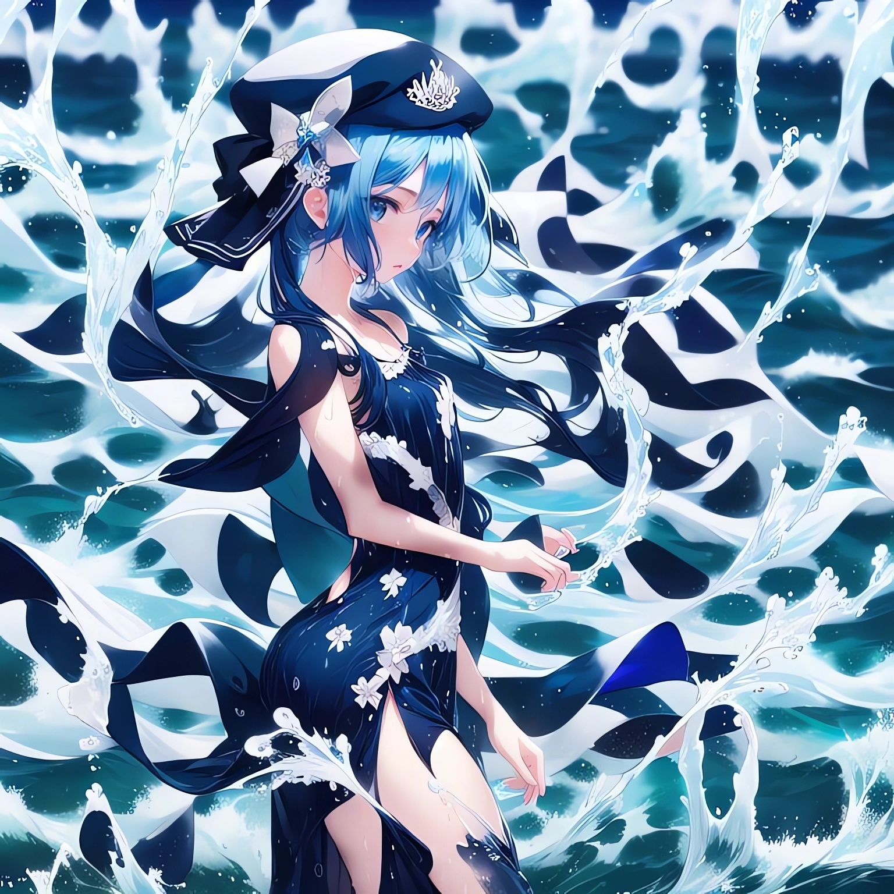
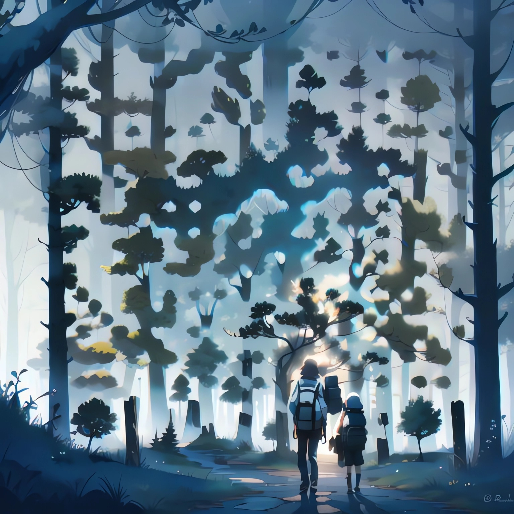
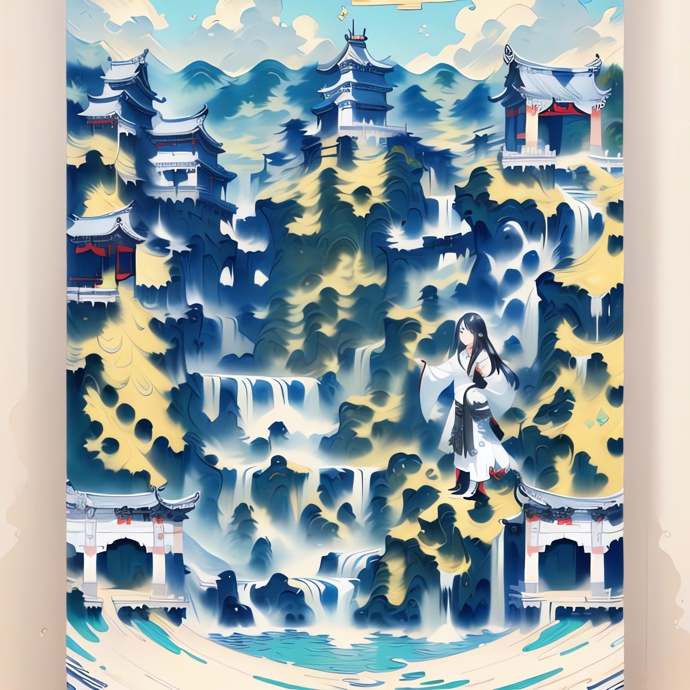
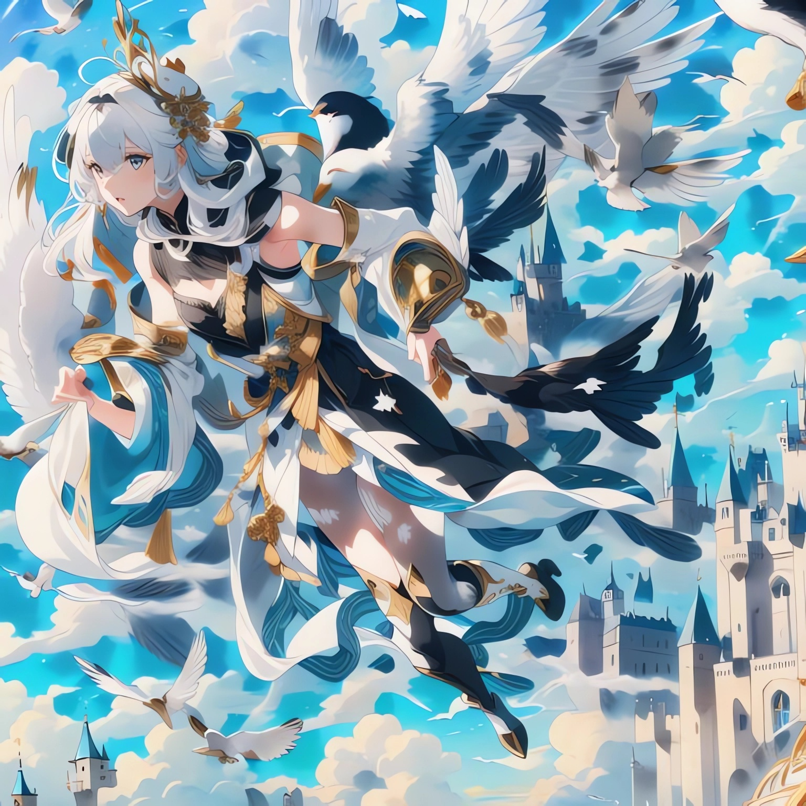
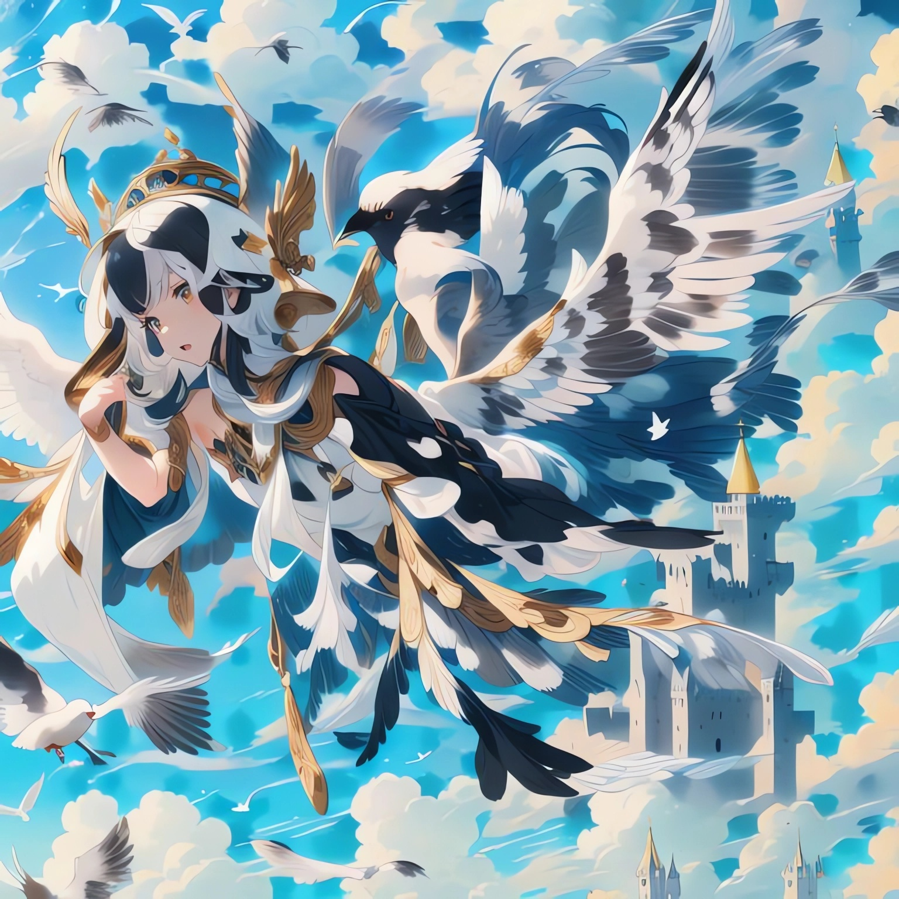
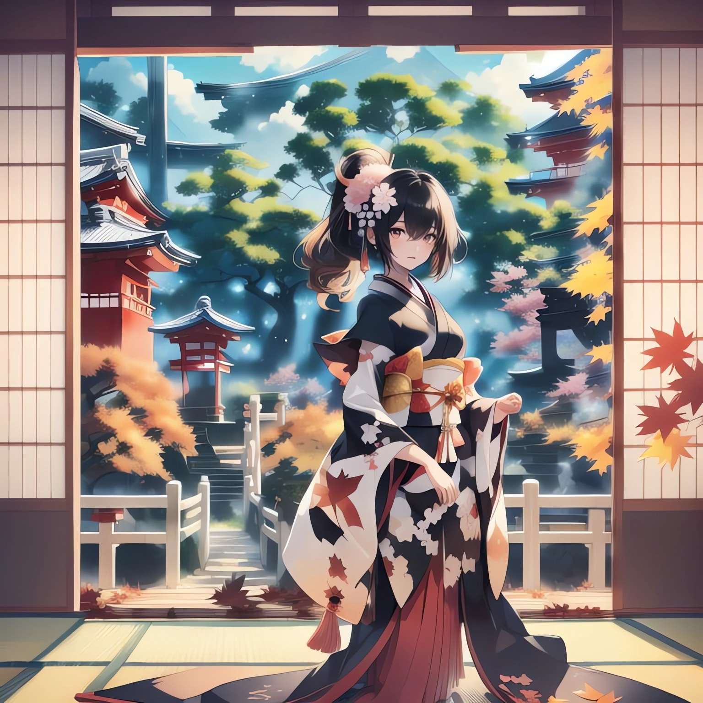

I have tried **HARD** to generate a photo of *a brain or a neuron* that can be
scanned. But unfortunately, either it cannot be recognized as a QR code or it is
irrelevant to my prompts.😭 

It is much easier to generate that of girls or natural scenery though. Perhaps
it's better to choose another stable diffusion checkpoint. (By the way, thanks
to [Stable Diffusion
WebUI](https://github.com/AUTOMATIC1111/stable-diffusion-webui), it is quite
easy to deploy famous diffusion models.)

So, here are some of artworks generated by Stable Diffusion:

---

For those who'd like to generate QR code for yourselves, check Anthony FU's blog
[[1]](https://antfu.me/posts/ai-qrcode-101) and
[[2]](https://antfu.me/posts/ai-qrcode-refine)
