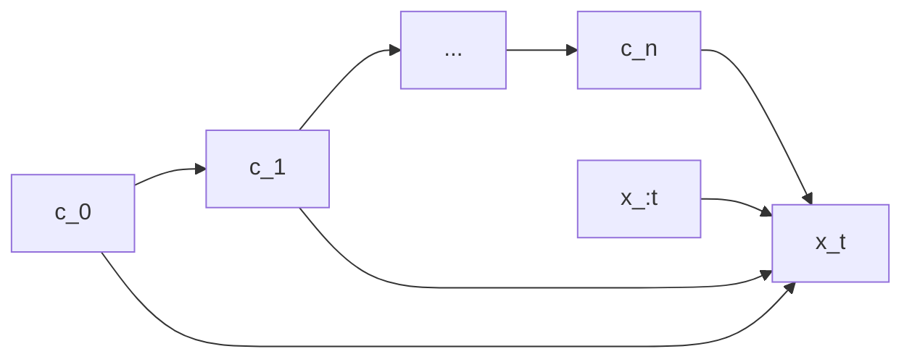

# Prerequisite

- Basic knowledge of the structure of Transformer and RNN
- Understand how to train AI models in NLP

Notations:

| Symbol | Meaning |
| --- | --- |
| $x_t$ | token at time $t$ |
| $x_{:t}$ | tokens before time $t$ |
| $x_{a:b}$ | tokens after time $a$ (included) and before time $b$ (excluded) |
| $p$ | the distribution of ground truth |
| $q$ | model's prediction |
| $v$ | vocabulary size (# of different tokens) |
| $d$ | embedding dimension (dimension of hidden states) |

# Main

**This blog will explore some potential factors contributing to the distinction between text generated by LLMs and human's text.**

To start with, let's first consider a statistical model. A causal Large Language Model (LLMs) approximates the true conditional distribution $p(x_t|x_{:t})$ with its own predictive distribution $q(x_t|x_{:t})$. If $q(x_t|x_{:t}) = p(x_t|x_{:t})$ for every token $x_{1:t+1}$, we have $q(x_{1:t+1}) = p(x_{1:t+1})$, which means the distribution of the model's generated text is identical to human's text, implying that LLM's text is indistinguishable from human's. However, this is clearly not the case in practice. For instance, this is an [online demo](https://detectgpt.com/app/) to detect if the text is generated by AI. You can try it out yourself.

Since a model capable of perfect next-token prediction would produce indistinguishable texts from human writing, the divergence observed in real-world models must stem from imperfect prediction. Yet, stopping the analysis at this point would be both superficial and uninformative. Therefore, a more detailed examination of the triplet -- data, model, and optimizer -- is warranted.

## Data 

### Hierarchical Long-tailed Imbalance (Hypothesis)

When humans produce speech, they select the next word based on their memory, intention, emotion, the role of the interloctor, e.t.c. Thus, the next token prediction of a perticular person can be formalized as $p(x_t|x_{:t},c)$, where $c$ represents the context information. However, in a typical dataset, explicit context is omitted, leading to the marginal distribution: 

$$p(x_t|x_{:t}) = \sum_c p(x_t, c | x_{:t}) = \sum_c p(x_t | x_{:t}, c) p(c|x_{:t})$$.

In end-to-end modeling, it is unnecessary -- by Occam's razor -- to explicitly model the latent context prediction. Nevertheless, introducing the concept of context can yield valuable insights, which we will elaborate on below.

Pretraining data are commonly scraped from the web. Formal and precise texts, such as those found in encyclopedias, are produced under strong constraints—adherence to grammatical rules, standardized terminology, and an objective tone. This consistency allows such texts to be interpreted as originating from a similar contextual domain, at least in terms of stylistic features. In contrast, conversational data from chat rooms exhibit high variability and informality, making such contexts sparse and long-tailed in the overall data distribution. We argue that this imbalance can lead to disparities in the performance of text-generation models.

To illustrate why the data distribution is long-tailed, consider a simplified scenario: suppose a custom dataset contains only Wikipedia-style text and chatroom-style text. There are 1 million tokens of Wikipedia-like text and 10 distinct chatroom styles, each with only 1,000 tokens. In this case, chatroom-style data constitute roughly 1% of the total. Even if the model performs poorly on chatroom-style data, there is still a 99% probability that a human evaluator would fail to distinguish between human and model-generated text—provided the model performs well on Wikipedia-style content. In reality, however, performance discrepancies are often noticeable across many domains, suggesting that the long-tail effect has practical significance.

Moreover, this type of analysis need not be limited to context alone; it can be extended to intermediate linguistic and situational layers. This leads us to a hierarchical interpretation of the hypothesis: humans likely generate each subsequent token based on a hierarchy of contextual factors, ranging from broad situational cues to fine-grained stylistic and interpersonal elements.

where the refresh rate increases from $c_0$ to $c_n$. For example, $c_0$ represents the long-term goal while $c_n$ represents the thoughts on the sentence level. We may expand the formula $p(x_t|x_{:t})$ in the form 
$$
\begin{align*}
p(x_t|x_{:t}) &= \sum_{c_0}\sum_{c_1}\cdots\sum_{c_n} p(x_t,c_0,c_1,\cdots, c_n | x_{:t}) \\
&= \sum_{c_0}\sum_{c_1}\cdots\sum_{c_n} p(x_t|c_0,c_1,\cdots c_n, x_{:t}) \prod_{i=0}^n p(c_i|c_0, c_1, \cdots, c_{i-1}, x_{:t})
\end{align*}
$$
where we define $c_{-1} = \varnothing$.

We clain that the "context imbalance" occurs on every level from $c_0$ to $c_n$. For example, on the token level, some words occurs much more frequently than others; on the sentence level, idioms are relatively fixed expressions; on paragraph level, wiki-style text has a higher frequency than personal, emotional styles.

Even though you are right, what does it have anything to do with the distribution dinstinction between the human-generated text and model-generated text? After all, if the model is perfect predictor, you should not have distinguish them. Yes, But the model is not a perfect predictor. We suppose the model has a better performance on frequent contexts and vice versa. For example, the hypothesis implies model should be more indistinguishable when generating wiki text than chatroom text. This can be verified easily.

Theories and experiments are ongoing.

## Model

In the foregoing text, we describe the model as a conditional predictor. But that abstracts over the internal structure of the model and does not provide many deep insights. So let's go deeper and stretch it harder.

### Softmax Bottleneck

#### Limit of Rank

The following is based on [this paper](https://arxiv.org/abs/1711.03953) (2018 ICLR Oral, cited by 482).

Let's add the details of softmax into our model. Let's model the softmax layer like this $p(\cdot | x_{:t}) = \text{softmax}(Dh_t)$ where $h_t$ is the hidden state at time $t$ right before the softmax and $D\in \mathbb R^{v \times d}$ is the dictionary with each row being a word embedding. 

Note that the softmax function is invariant to translation w.r.t. logits, namely $\text{softmax}(l) = \text{softmax}(l+\mathbf 1)$ where $l\in \mathbb R^v$ and $\mathbf 1$ is a $v$-dimensional all-ones vector. If our model can produce any distribution over the vocabularies, then given a ground truth logits $l^*\in \mathbb R^v$, there must exist $\lambda\in \mathbb R$ and a hidden states $h$ such that $Dh + \lambda \mathbf 1 = l^*$. We derive $ \mathbb R^v \subseteq DH \oplus \mathbf 1$ where $H$ is space of all possible $h$ ($H$ is not necessary a linear space), $DH=\{Dh: h\in H\}$, $\oplus$ represents the direct sum. Then we have $d + 1 = \text{rank}(D) + 1\ge \text{dim}(DH) + 1 \ge \text{dim}(DH\oplus \mathbb 1) \ge \text{dim}(\mathbb R^v) = v$, where the dimension of a (not necessarily linear) space $M\subseteq \mathbb R^n$ is defined as the dimension of the smallest linear subspace of $\mathbb R^n$ covering $M$. Therefore, $d \ge v$ is the necessary condition for a softmax function to express every distribution over the the vocabularies. But in practise, $d \ll v$. The following table shows the comparison of $v$ and $d$ for some common models:

| Family | Variant | $v$ | $d$ |
| --- | --- | ---: | ---: |
| GPT | GPT-2 | 50257 | 768 |
|     | GPT-4 | ~100000 | ? |
| Llama |  Llamma-2 | 32000 | 4096 |
|      |Llamma-3 | 128256 | 4096 |
| Gemma | Gemma-2B |  256128 |  2048 |
|  | Gemma-7B |  256128 | 3072 |

($v$ of GPT-4 is estimated from CL100K while $d$ is unknown due to CloseAI.)

Because of the belief on the expressiveness of a low-dimensional real vector, $d$ is typically much smaller than $v$. But our derivation shows that this can degrade the expressiveness when it's combined with softmax. [This paper](https://arxiv.org/abs/2406.04289) provides an empirical support to the softmax bottleneck theory.

#### Limit of Inner Product Space

The following is based on [this paper](https://aclanthology.org/2022.acl-long.554.pdf) (2022 ACL, cited by 27)

Another way to look at the limitation of softmax is consider the following fact: if "`queen` + `man` = `king` + `woman`" in the embedding space, then it is impossible to assign higher logits to both `queen` and `man` than both `king` and `woman`. Otherwise, calculating the inner product with the hidden states on both sides of the equation gives the contradiction.

### Expressiveness on Formal Language

Another perspective of proving the model's inability on learning human language is narrowing down our vision to a subset of human language and delineate the boundary of the model's capabilities. For example, if we can prove that Transformers are a subset of $AC^0$, then any problem beyond $AC^0$ cannot be solved accurately in a Transformer, thus leading to a distinction on the distributions of human's language and model's. This is just an example, for a more precise formulation, see text below.

For example, [this paper](https://aclanthology.org/2022.tacl-1.49.pdf) (2022 ACL, cited by 161) proves transformers are uniform constant depth threshold circuits. There are also papers researching the expressiveness of a multi-layered transformer, like [this paper](https://arxiv.org/abs/2412.02975) (2024 COLM, cited by 23) and [this paper](https://arxiv.org/abs/2402.09963) (2024 ACL best paper, cited by 43).

However, these studies only focus on the model's performance on formal languages. In reality, most of the language generated by models is not formal. Although these studies suggest that in certain specific generation tasks, we can distinguish between model-generated text and human-generated text, this conclusion cannot be generalized to claim that in most generation scenarios, we have a high probability of distinguishing between human-generated text and model-generated text.

## Training Strategy

### Fine-tuning

In RLHF, human has a perference for a type of answers (for example, more confident or longer answers are preferred). After post-training, the model's distribution exhibits a difference from its original distribution. For example, the distribution becomes more accute. [This paper](https://arxiv.org/abs/2510.14901v1) (2026 ICLR, cited by 5) utilizes this observation and make the output distribution more accute directly by a sample technique called power sampling.

However, even if there is not fine-tuning, a purely pretrained model's text can still be identified. This pushes us to other causes.

# A Big Picture

This is not an isolated study. It stems from one of my core problems: is it possible to predict the resulting performance of a triplet (data, model, trainer) without training (or with less calculation than training)? This question has given rist to an entirely new field of research, zero-cost proxy for NAS. [This blog](https://iclr-blog-track.github.io/2022/03/25/zero-cost-proxies/) provides a gentle introduction to this area. Briefly speaking, we tend to design our model in a intuitive way, but is there a method such that we can designe a talored model and trainer given a dataset from the first principle and we can ensure that this model would have a descent performance on the dataset? To answer this question, I need to research the implicit bias of different models. For example, the classes of finite precision RNN LMs and DPFSA are equivalent (, proved in [this paper](https://aclanthology.org/2023.emnlp-main.502)). This blog is studying the innate ability of LLMs, which also aligns with my pursuit of the core problem.
